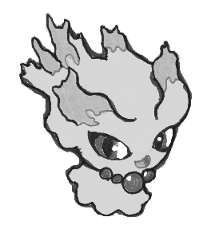

# ムウマ統一概論

###### ムウマ統一　紳士のチイセ

## 1．ムウマ統一の得手不得手

種族統一は得手不得手がはっきりするパーティ構成であると言える．特にムウマ統一はそれが顕著である．なぜか，それはムウマというポケモンの特徴にある．ムウマは「ゴーストタイプ」に属しており，「ノーマルタイプ」・「かくとうタイプ」の技の被ダメージを無効にし，「どくタイプ」・「むしタイプ」の技の被ダメージを半減する．また，被ダメージにおいて効果抜群となってしまうのは「ゴースト」・「あく」のみであり，タイプ相性上優位性が高い．この優位性から見せ合い段階で相手が使用するポケモンの絞り込みが容易いこと，無効・半減タイプの塩梅から相手の使用できる技を限定することは，れっきとした得手と言える．

ムウマはレベルで覚える技がわりかし貧相と言わざるを得ないが，遺伝・わざマシン・教え技等で補われた結果，覚える技が豊富で通用範囲が広い状態になっている．

※以下，オメガルビー・アルファサファイアにおいてムウマがレベルアップ・遺伝・技マシン・教え技によって覚える技を列挙しておく．

| レベルアップによって覚える技 |                |          |      |
| ---------------------------- | -------------- | -------- | ---- |
| レベル                       | 技名           | タイプ   | 分類 |
| Lv1                          | なきごえ       | ノーマル | 変化 |
| Lv1                          | サイコウェーブ | エスパー | 特殊 |
| Lv5                          | うらみ         | ゴースト | 変化 |
| Lv10                         | おどろかす     | ゴースト | 物理 |
| Lv14                         | あやしいひかり | ゴースト | 変化 |
| Lv19                         | くろいまなざし | ノーマル | 変化 |
| Lv23                         | たたりめ       | ゴースト | 特殊 |
| Lv28                         | サイケこうせん | エスパー | 特殊 |
| Lv32                         | いたみわけ     | ノーマル | 変化 |
| Lv37                         | しっぺがえし   | あく     | 物理 |
| Lv41                         | シャドーボール | ゴースト | 特殊 |
| Lv46                         | ほろびのうた   | ノーマル | 変化 |
| Lv50                         | おんねん       | ゴースト | 変化 |
| Lv55                         | パワージェム   | いわ     | 特殊 |

| 遺伝によって覚える技 |          |      |
| -------------------- | -------- | ---- |
| 技名                 | タイプ   | 分類 |
| いやなおと           | ノーマル | 変化 |
| みちづれ             | ゴースト | 変化 |
| おきみやげ           | あく     | 変化 |
| わるだくみ           | あく     | 変化 |
| のろい               | ゴースト | 変化 |
| ふういん             | エスパー | 変化 |
| スキルスワップ       | エスパー | 変化 |
| ワンダールーム       | エスパー | 変化 |
| さきどり             | ノーマル | 変化 |
| かげうち             | ゴースト | 物理 |
| ふいうち             | あく     | 物理 |
| あやしいかぜ         | ゴースト | 特殊 |

| わざマシンによって覚える技 |                  |            |      |
| -------------------------- | ---------------- | ---------- | ---- |
| 番号                       | 技名             | タイプ     | 分類 |
| 4                          | めいそう         | エスパー   | 変化 |
| 6                          | どくどく         | どく       | 変化 |
| 10                         | めざめるパワー   | ノーマル   | 特殊 |
| 11                         | にほんばれ       | ほのお     | 変化 |
| 12                         | ちょうはつ       | あく       | 変化 |
| 17                         | まもる           | ノーマル   | 変化 |
| 18                         | あまごい         | みず       | 変化 |
| 21                         | やつあたり       | ノーマル   | 物理 |
| 24                         | 10万ボルト       | でんき     | 特殊 |
| 25                         | かみなり         | でんき     | 特殊 |
| 27                         | おんがえし       | ノーマル   | 物理 |
| 29                         | サイコキネシス   | エスパー   | 特殊 |
| 30                         | シャドーボール   | ゴースト   | 特殊 |
| 32                         | かげぶんしん     | ノーマル   | 変化 |
| 40                         | つばめがえし     | ひこう     | 物理 |
| 41                         | いちゃもん       | あく       | 変化 |
| 42                         | からげんき       | ノーマル   | 物理 |
| 44                         | ねむる           | エスパー   | 変化 |
| 45                         | メロメロ         | ノーマル   | 変化 |
| 46                         | どろぼう         | あく       | 物理 |
| 48                         | りんしょう       | ノーマル   | 特殊 |
| 49                         | エコーボイス     | ノーマル   | 特殊 |
| 57                         | チャージビーム   | でんき     | 特殊 |
| 61                         | おにび           | ほのお     | 変化 |
| 63                         | さしおさえ       | あく       | 変化 |
| 66                         | しっぺがえし     | あく       | 物理 |
| 70                         | フラッシュ       | ノーマル   | 変化 |
| 73                         | でんじは         | でんき     | 変化 |
| 77                         | じこあんじ       | ノーマル   | 変化 |
| 85                         | ゆめくい         | エスパー   | 特殊 |
| 87                         | いばる           | ノーマル   | 変化 |
| 88                         | ねごと           | ノーマル   | 変化 |
| 92                         | トリックルーム   | エスパー   | 変化 |
| 94                         | ひみつのちから   | ノーマル   | 物理 |
| 97                         | あくのはどう     | あく       | 特殊 |
| 99                         | マジカルシャイン | フェアリー | 特殊 |
| 100                        | ないしょばなし   | ノーマル   | 変化 |

| 教え技によって覚える技 |                |          |      |
| ---------------------- | -------------- | -------- | ---- |
| BP                     | 技名           | タイプ   | 分類 |
| 4                      | いびき         | ノーマル | 特殊 |
| 4                      | でんげきは     | でんき   | 特殊 |
| 8                      | さわぐ         | ノーマル | 特殊 |
| 12                     | ハイパーボイス | ノーマル | 特殊 |
| 12                     | イカサマ       | あく     | 物理 |
| 8                      | スキルスワップ | エスパー | 変化 |
| 8                      | いたみわけ     | ノーマル | 変化 |
| 8                      | うらみ         | ゴースト | 変化 |
| 8                      | トリック       | エスパー | 変化 |
| 8                      | よこどり       | あく     | 変化 |
| 8                      | マジックコート | エスパー | 変化 |
| 8                      | いやしのすず   | ノーマル | 変化 |
| 8                      | マジックルーム | エスパー | 変化 |
| 8                      | ワンダールーム | エスパー | 特殊 |
| 12                     | こごえるかぜ   | こおり   | 特殊 |

※続いて，過去作・過去作連動作でしか覚えられないムウマの技を列挙しておく．互換機能を使ってＸ・Ｙ，オメガルビー・アルファサファイアに転送できるものに限定した．

| **技名**       | **習得方法**                                                 |
| -------------- | ------------------------------------------------------------ |
| すてみタックル | 教え技（各一度きり）  ・チャンピオンロード出口   　（FRLG）  ・ルネシティ民家    　（エメラルド）  ・アゲトビレッジ    　（ポケモンXD） |
| ものまね       | 教え技（各一度きり） ・ヤマブキシティものまね娘   （FRLG） ・フエンタウン民家   （エメラルド） ・アゲトビレッジ   （ポケモンXD) |
| まるくなる     | 教え技（BP引き換え） ・バトルフロンティア16BP   （エメラルド） |
| あくむ         | 教え技(一度きり)   ・アゲトビレッジ   （ポケモンXD）     |
| ずつき         | 教え技（何度でも可） ・ウバメのもり（HGSS）              |
| スピードスター | 教え技（BP引き換え） ・バトルフロンティア24BP   （エメラルド） ・バトルフロンティア40BP   （HGSS） 教え技（欠片合わせ） ・キッサキシティ青2黄2緑4   （プラチナ） |
| こらえる       | 教え技（BP引き換え） ・バトルフロンティア48BP   （エメラルド）  わざマシン58   （DP，Pt，HGSS） |
| ゆうわく       | わざマシン78   （DP，Pt，HGSS）                              |
| しぜんのめぐみ | わざマシン83   （DP，Pt，HGSS）                              |
| テレキネシス   | わざマシン19   （BW，BW2）                                   |

覚える技の分類では変化技の比重が多く，相手の戦術をかき乱したり自分の火力や耐久を補強したりといったバランサー的側面を持った戦い方ができようになっている．

さらに，特殊技のなかにはそれを助長するかのような技が存在している．「たたりめ」や「こごえるかぜ」などである．「たたりめ」は『相手のポケモンが状態異常であるとき技の威力が2倍になる』というもので「でんじは」や「おにび」などで状態異常にできるし，「でんじは」であれば相手の素早さを下げたうえ「まひ」の状態効果で痺れによる行動不能が有り得るし「おにび」であれば「やけど」の状態効果で攻撃が下がった状態になるため，ムウマが場にいやすくなるので調子に乗って「わるだくみ」で自分の特攻あげて殴るなんてことも可能である．

「こごえるかぜ」は相手の『すばやさを一段階さげる』という技で相手にポケモン交換を促すことができるため「めいそう」や「わるだくみ」を積みやすくする環境を構築しやすい．変化技が豊富であるということは「ちょうはつ」による変化技の禁止，「トリック」「すりかえ」によるこだわり系アイテム押し付け，「アンコール」による技の固定などには注意が必要であることはいわずもがなであろう．

その一方で，火力技は少なくムウマ自身の攻撃，特攻も高くないため火力で押すということは不得手である．ただ，アイテムの補正もあるし相手ポケモンとのタイプ相性や耐久よっては押せることもあると一言添えておく．

物理技に注目してみると面白い技がいくつかある．

その一つ目は「しっぺがえし」．これは『自分が後攻であったときに技の威力が2倍になる』というものなのだが，ムウマにとって有用かどうかと言われればはっきし言って有用ではない．だが，そんなことはどうでもいい．ムウマが使って様になっているか，ぴったしであるかこれが重要なのだ．ジャストミート！一度ゲーム画面で確認してみるのがいいだろう．ムウマの悪態付いた顔にエフェクト、すばらしいではないか......とまあ余談はさておき，種族統一には有用ではないが，かゆいところに手が届くいわゆる絶妙技が二，三個存在する．「しっぺがえし」とはムウマ統一にとって絶妙技の一つである．では，そのことを説明していこうと思う．前置きとして，私の経験談をば，ムウマ統一は物理耐久がそこまでない素早いエスパータイプ（スターミー，バリヤード，エーフィ等）が初手出てくることが有る．その場合，大抵「めいそう」を積まれたり「ひかりのかべ」なんかを張られたりするわけだが，そういう先入観たっぷりの奴にきっつい一撃をお見舞いでき，「かげうち」の追撃で処理することができる．

ムウマのすばやさ種族値は85で最遅の実数値は81となり，この数値は無振りすばやさ種族値64族まで抜かれることが可能である．すばやさ種族値85から，すばやさ種族値64の間にどんなポケモンがいるのだろうか．数も多くないし，そこまで出くわすことはないが「ひかりのかべ」を張られたり「めいそう」等を積まれたりすることによって，途端にやっかいになるポケモンたちが集結している．ブーピック，（フワライド），（エムリット），（シャンデラ），（ネンドール），（メガジュペッタ），ルナトーン，（ソルロック），（パンプジン），スリーパー，チリーン，（ゴチルゼル）と言った具合で，特に括弧付きでないポケモンたちは防御より特防の方が高く，「めいそう」「ひかりのかべ」を覚えることができるため，俗にいう「かべ要員」としての任務を遂行するのにちょうどよいポケモンたちと言える．そのため，ムウマの「しっぺがえし」が通りやすいのである．

括弧付きのポケモンたちは，特防より防御の方が高いポケモン（ソルロック，パンプジン，ゴチルゼル），または，防御特防にそこまで差異がないので，そのまま「しっぺがえし」をしたのでは通らないポケモン（エムリット，ネンドール），もしくは，すばやさを無振りにすることは稀でムウマが無振り・準速程度であれば普通に抜かれるポケモン（フワライド，エムリット，シャンデラ，メガジュペッタ）である．防御が高いポケモンたちには「ワンダールーム」を敷いて防御と特防の実数値を入れ替えたり，防御と特防の差異がないポケモンには「いやなおと」を放って防御を二段階下げたりすることで「しっぺがえし」を通すことは可能である．

二つ目は「つばめがえし」で，これもムウマにとって絶妙技と言える．理由は二つあり，一つ目はムウマにとって唯一無二の「ひこうタイプ」技であること，二つ目は必中技であることである．この二点により，

1.  「ひこうタイプ」技が弱点で防御耐久が低く「つばめがえし」でも与ダメージを期待できるポケモンたち（ダーテング，ロゼリア，ロズレイド，ハハコモリ）に有効である．

2.  「ひこうタイプ」技が四倍弱点でありムウマより素早さが遅いポケモンたち（パラセクト，メガヘラクロス，キノガッサ，ミノマダム〈くさき〉，ブリガロン）に有効である．

3.  その他，「ひかりのかべ」を覚えられるため特殊耐久に特化させ「かげぶんしん」を積むことで，その場に居座る戦術のできるポケモン（ドクケイル）に対して有効である．加えて，火力は控えめだが耐久が整っていて，さらに耐久をあげるための技を有しているため，その場に居座る戦術を得意とするが「ひこうタイプ」技が四倍弱点であるポケモン（ビリジオン）を，ごり押しで退けることができたりする．

続いて，ムウマの特性は「ふゆう」のみでこの特性の効果としては「じめんタイプ」の技(「すなかけ」を除く)，「まきびし」，「どくびし」，「ねばねばネット」を無効にし，特性「ありじごく」の効果を無効にする．ただし，技「うちおとす」で撃ち落とされたり，技「じゅうりょく」によって場が重力状態にあったり，相手のポケモンの特性が「かたやぶり」であった場合は，前述した特性「ふゆう」の効果は消失してしまう．ムウマ単体として見た時には「じめんタイプ」のポケモンに優位に立てるだけではなく，戦況上「じめんタイプ」の技を見越してムウマと交換することによって形勢を変える所謂無償降臨を成すこともできる．さらに，配置系の技を無効にするため，それらの技を基軸とした戦法とるポケモンを選出の段階で抑制する働きもあるのでとても有用な特性と言える．ただし，種族統一となると話は少し変わる．種族統一のパーティ構成上どうやってもムウマ6匹なわけで，特性は「ふゆう」しかない．つまり，相手は事前に身構えて対戦できるわけである．ノーマルルール下の「通りすがり対戦」においては，相手が「じめんタイプ」の比重が高いパーティでもない限りは，選出段階での抑制くらいしか特性上の優位性がなく，ほとんど特性の恩恵をうけない．また，特性「かたやぶり」のポケモンでも居ようものなら，特性がないものとして戦うしかないわけで，若干ではあるが不利な状態で対戦が始まると言える．

　さて，ここで特性「ふゆう」持ちの天敵とも言える特性「かたやぶり」持ちのポケモンを列挙しておくこととする．

カイロス，（ズガイドス）ラムパルド，（キバゴ）（オノンド）オノノクス，（ヤムチャム）ゴロンダ，（夢：モグリュー）夢：ドリュウズ，夢：ナゲキ，夢：ダゲキ，夢：バスラオ，夢：クリムガン，夢：ルチャブル，メガシンカ：ギャラドス，メガシンカ：デンリュウ

>  **合間にムウマの実戦において役には立たない豆知識　その1**  
>  ムウマージは覚えるがムウマは覚えられない技  
>  ゴーストダイブ，マジカルフレイム，エナジーボール，はかいこうせん，ギガインパクト

## 2．ムウマ統一の相違点

種族統一とタイプ統一は，よく比較されることがある．総じて，種族統一とタイプ統一は戦法戦術上代わり映えしない，似通っていると思われている方は多いように思う．そこで，種族統一とタイプ統一とは性質が同じパーティなのか否か．そのことをムウマ統一とゴーストタイプ統一との比較を通して明確にしていきたいと思う．

まずは，ゴーストタイプ統一とは何かということをざっくり説明しておくこととする．ゴーストタイプ統一は，その名称が表す通り，ゴーストタイプ単一・複合の第一タイプ，もしくは，第二タイプがゴーストタイプであるポケモンのみで構成されたパーティで，具体的には以下のポケモンたちのことを指す．

ゴース，ゴースト，ゲンガー，**ムウマ**，ヌケニン，ヤミラミ，**カゲボウズ**，**ジュペッタ**，**ヨマワル**，**サマヨール**，フワンテ，フワライド，**ムウマージ**，ミカルゲ，**ヨノワール**，ユキメノコ，ロトム〈ノーマル〉，（ギラティナ），**デスマス**，**デスカーン**，プルリル，ブルンゲル，ヒトモシ，ランプラー，シャンデラ，ゴビット，ゴルーグ，ヒトツキ，ニダンギル，ギルガルド，ボクレー，オーロット，バケッチャ，パンプジン，（フーパ）

ムウマ統一とゴーストタイプ統一の似通っている点の一つ目は，弱点が共通するということであろう．ただし，これは「ゴーストタイプ」単一のみでゴーストタイプ統一を構築した場合に限られる．

ヤミラミ・ミカルゲは「ゴーストタイプ」・「あくタイプ」の複合により「ゴーストタイプ」単一の弱点である「ゴーストタイプ」技と「あくタイプ」技が等倍になり，その代わりに「ゴーストタイプ」単一では等倍であるはずの「フェアリータイプ」技が弱点となり効果抜群となる．その他，複合タイプを持つポケモンたちは「ゴーストタイプ」の弱点だけではなく，対になるタイプの弱点も内包するため，自ずと弱点は増える．そして，「ゴーストタイプ」単一であるポケモンはムウマを含んで9匹（上記太字のポケモン）であり，そのうち最終進化系はたったの4匹しかいない．そのため，「ゴーストタイプ」単一でタイプ統一を構築するのはバリエーションに乏しく，どうしても複合をもつポケモンを含めないとゴーストタイプ統一を構築できないのである．よって，ムウマ統一とゴーストタイプ統一の弱点は共通するものの，完全に一致することはほぼないと言えるのである．

似通っている点の二つ目は，タイプ一致技の威力が等しい，覚えられる技が類似しており通用範囲が一致しているということであろう．これは，端的に見ればその通りなのだが，踏み込んで見てみると違うことがわかる．

まず，タイプ一致技の火力を単に威力のみで見た場合に，ムウマにとって特殊技は「シャドーボール」(威力：80)が最高火力技となる．これは他の「ゴーストタイプ」と共通するのだが，物理技の場合はそうはいかない．「ゴーストタイプ」の最高物理技は「ゴーストダイブ」（威力：90）であるが，ムウマに関して言えば，この技はおろか，次点威力の「シャドークロー」，ついで「シャドーパンチ」も覚えることができず，「かげうち」（威力：40）が「ゴーストタイプ」最高物理技である．（どいうことだ？これは差別じゃないのか？ムウマは容姿的に手足がないのだから仕方がないだろう？と．まあいい百歩譲ってそういうことにして，シャドークローくらいはできそうじゃないか？無理か？無理なのか......ぐぎぎ）

タイプ一致技で最高火力と考えるときに，複合タイプの場合は対となるタイプの技が存在している．例えば，ユキメノコは「こおりタイプ」が付属しているため特殊技は「ふぶき」（威力：110）で，物理技は「れいとうパンチ」（威力：75）となる．ブルンゲルは「みずタイプ」が付属しており，特殊技としては「ハイドロポンプ」（威力：110）で，物理技は「たきのぼり」（威力：80）であり，まずまずの火力技を特殊物理ともに備えている．シャンデラは「ほのおタイプ」が付属しているため，特殊技では「オーバーヒート」（威力：130）と申し分ない技が存在するし，物理技では「ニトロチャージ」（威力：50）に甘んじるしかないわけである．

ムウマ統一は当然のことながらムウマしかいないわけで，タイプ一致最高火力技は「シャドーボール」と「かげうち」であり，前項目であげた覚える技の範疇以外で技の通用範囲が広がる可能性はない．対して，「ゴーストタイプ」統一は複合タイプのポケモンを登用できる時点でタイプ一致技が千差万別であり，組み合わせ次第で通用範囲を広げることは可能である．

以上の事柄から，種族統一とタイプ統一は似通っているように思えだけでまったく性質の違うパーティであることがお分かりいただけたと思う．

> **合間にムウマの実戦において役には立たない豆知識　その2**  
> ムウマのおもさは1.0kgなので「くさむすび」の威力は20，「ヘビーボンバー」・「ヒートスタンプ」の威力は120で被弾することになる．「みやぶる」「かぎわける」を使用された場合を想定して「けたぐり」は威力20での被弾となる．

## 3．ムウマ統一の持ち物

「しんかのきせき」・「こだわりメガネ」・「こだわりスカーフ」・「きあいのタスキ」と言ったメジャーどころ普遍的なアイテムではなく，ムウマと親和性の高いアイテムたちに焦点を絞って紹介する．

### 1.カシブのみ
  アイテムの分類：きのみ                                                     
  アイテムの効果：効果抜群のゴーストタイプ技のダメージを一度だけ半減する．   
  入手方法：20番道路で拾う（X・Y），123番道路の木から採取（ORAS）

対「ゴーストタイプ」の一アイテムと言え，ゲンガーやシャンデラといった高火力での「シャドーボール」でも一度耐えることができ，応対が可能である．

また，タイプ不一致による「シャドーボール」であれば確定3発にできることも強みといえよう．

### 2.ナモのみ

アイテムの分類：きのみ                                                     
アイテムの効果：効果抜群のあくタイプ技のダメージを一度だけ半減する．   
入手方法：5番道路等のバトル中採取（X・Y），123番道路の木から採取（ORAS）

前刊でも触れたが今刊でも口すっぱく取り上げることとする．対「あくタイプ」と言いたいところだが，実際には，対「はたきおとす」である．X・Yから「はたきおとす」が大幅に強化され一気に搭載率があがったため，自ずと対策が必要になる．「ナモのみ」であれば叩き落とされる前に半減の効果が働く．輝石対策等でタイプ不一致の「はたきおとす」を搭載しているポケモンはこれでいかようにも施すことができる．

### 3.ゴツゴツメット

アイテムの分類：道具                                                     
アイテムの効果：接触技を受けたとき相手にHPの6分の1のダメージを与える．   
入手方法：9番道路にて貰う（X・Y），てんきけんきゅうじょで貰う（ORAS）

接触技のほとんどは物理技に集中しており，物理技のなかで非接触技は「じしん」などの「じめんタイプ」技に限られるので，特性「ふゆう」を持つムウマは接触技を受けやすい．そのため，物理受けをする際に「ゴツゴツメット」を持たせることは理にかなっていると言える．

### 4.ねらいのまと

アイテムの分類：道具                                                     
アイテムの効果：タイプ相性で無効であった技が当たるようになってしまう．   
入手方法：バトルハウス32BPで交換（X・Y），バトルハウス32BPで交換（ORAS）

前刊において紹介した輝石強奪型もそうだが，「ノーマルタイプ」全般に押し付けて「シャドーボール」が通用するようにできるメリットは大きい．例えば，交代戦となって後続にこだわり系持ちを選出したとしても悩むことなく「シャドーボール」等を繰り出せるし，「たたりめ」戦法も躊躇なく持続可能である．

特性「おみとおし」持ちには留意しないといけない．このアイテムは持っていることを察知された時点で作戦がもろばれになってしまうからである．

※以下、「おみとおし」を持つ「ノーマルタイプ」のポケモンたち．

夢：プクリン，（夢：オタチ）夢：オオタチ，オドシシ

### 5.ぼうじんゴーグル

アイテムの分類：道具                                                     
アイテムの効果： 「すなあらし」「あられ」のダメージを受けず，技「ねむりごな」「しびれごな」「どくのこな」「キノコのほうし」「わたほうし」「いかりのこな」「ふんじん」を無効にする．   
入手方法：バトルハウス48BPで交換（X・Y），111番道路で貰う（ORAS）

ピンポイントではあるが，天候パーティ（あられ，すなあらし）に対して物理・特殊受けを展開する際には非常に有益なアイテムである．というのも，天候のダメージに左右されず「いたみわけ」あるいは「ねむる」と言った回復行動の目算をつけやすいからである．また，一項目で「つばめがえし」の有用性について触れたが，それと合わせてキノガッサに圧倒的に優位になれること，ビビヨンを筆頭に「ねむりごな」からの「ちょうのまい」を完全に封殺できる魅力もある．

### 6.メンタルハーブ

アイテムの分類：道具                                                     
アイテムの効果：「ちょうはつ」「いちゃもん」「アンコール」「かなしばり」等で受ける制限を一度だけ解除する．   
入手方法：20番道路で拾う（X・Y），キャモメの手紙イベント（ORAS）

ムウマは輝石を警戒されているのか「ちょうはつ」等を誘引しやすい．そのため，技説明にあるような技群を警戒しないといけないのだが，如何せん覚えるポケモンが多すぎて警戒しきれず，油断すると飛んできてしまってやりたいことが出来ないなんてことがままある．素早さが高いが耐久はないポケモンには「でんじは」さえ撒けば...とか，典型的な物理アタッカーには「おにび」さえ入れば火力を殺せるのに...とか，これさえ撒ければ対処が完了するポケモンは意外と多いわけで，そんなポケモンに限って「ちょうはつ」等を搭載しているので，そんな時にアイテムがあれば心強いわけである．

> **合間にムウマの実戦において役には立たない豆知識　その3**
> ムウマを倒して得られる努力値は第三世代までは特攻+1特防+1だったが，第四世代以降は特防+1となった．

## 4．ムウマ統一の強敵

ムウマ統一にも当然のことながら注意すべきポケモンがいる．そんな強敵たちを紹介しようと思う．

### 1.カイリキー，ローブシン

上記ポケモンたちは「かくとうタイプ」で「かくとうタイプ」技を無効にするムウマに分があるように感じられるが実はそうでもない．というのも，この二匹のポケモンに共通して気をつけなければならないことがある．それは「おにび」を撃つことである．どうしてと思われる方が多いと思うので説明しておく．

カイリキーの特性といえば十中八九「ノーガード」，そう思っていないだろうか？それで間違いない．ただし，そのおかげで忘れ去られてしまっているカイリキーの特性がある．「こんじょう」である．また，カイリキーは技「アンコール」を覚えるので，後攻で決められたときの悔しさは一入である．カイリキーはHPが高めで特防も優れているため，H252振りするだけでムウマの「サイコキネシス」を乱数2発，「こだわりメガネ」込みでも確定2発がやっとこせなので，「くろいてっきゅう」を「なげつける」（この場合威力130）や「しっぺがえし」（後攻時威力100）を「きあいのタスキ」等で耐えたとしても，次ターンに「バレットパンチ」が飛んできて撃沈ということは十分あり得る．

ローブブシンは，特性「こんじょう」，もしくは「ちからづく」を持っているため，「おにび」を撃って「やけど」状態にすれば火力を底上げしてしまう可能性がある．一方で，「おにび」を躊躇して「ちからずく」で蹂躙される可能性があったりするため厄介といえる．また，ローブシンも特防は低いもののHPが高いため，カイリキーほどではないが耐久調整をすればムウマの「サイコキネシス」などは耐え仰せ，ムウマに致命的な一撃を与える．ただ，カイリキーと違ってムウマに有効な先制技がないことがせめてもの情けといったところである．

|            | HP   | 特防 |
| ---------- | ---- | ---- |
| カイリキー | 90   | 85   |
| ローブシン | 105  | 65   |

#### ◎対策例　（個体値は最高値を想定している）

#### ・対カイリキー，ローブシン　ナモ・輝石型

| 性格                                      | 持ち物                                            | 努力値                                            | 技構成                                                       |
| ----------------------------------------- | ------------------------------------------------- | ------------------------------------------------- | ------------------------------------------------------------ |
| ひかえめ（ナモのみ） ずぶとい（輝石） | ナモのみ（推奨）       しんかのきせき（相応） | H252-C252-S6(ナモのみ) H252-B148-C108（輝石） | サイコキネシス（必須）  シャドーボール（ナモ時相応）       マジカルシャイン（ナモ時相応）       わるだくみ（ナモ時相応）       おにび（輝石時相応）       たたりめ（輝石時相応） |

##### 性格

「ひかえめ」一択．雀の涙ほどであろうとも火力を担保したい．汎用性を重視して「しんかのきせき」を持たせる場合は「ずぶとい」でも可．

##### 持ち物

「ナモのみ」が望ましい．「しんかのきせき」でも可．ただし努力値配分が変わってくるため注意．「なげつける」で「くろいてっきゅう」（威力：130）投げつけられたり，「しっぺがえし」（後攻の時威力：100）されたりして被弾した次のターンに「バレットパンチ」が飛んできても耐えられるようにするにはこれらのアイテムしかない．

##### 努力値

H252振りのカイリキーに対して，「ひかえめ」C252振りの「サイコキネシス」で乱数2発であるため，ムウマ一体で処理することは運否天賦と言える．二体目のムウマが無傷で倒すためには「かげうち」などの先制技を搭載しておく必要がある．ローブシンの場合はH252振りだけならば確定2発なのでその心配をする必要はない．「しんかのきせき」で対策した場合は確定3発となるため,二体目に多少のダメージはあり得る．

##### 技構成

「ナモのみ」を持たせる場合は「あくタイプ」も視野にいれ「マジカルシャイン」を採用するのもありだろう．また，不一致「あくタイプ」なら確定3発になる相手も存在するため，「わるだくみ」も採用の余地がある．「しんかのきせき」を持たせる場合は，オーソドックスに物理受けも想定して「おにび」と「たたりめ」をセットで採用してもよい．

#### ・対ちからずくローブシン　マジックルーム型

| 性格     | 持ち物                                             | 努力値                              | 技構成                                                       |
| -------- | -------------------------------------------------- | ----------------------------------- | ------------------------------------------------------------ |
| ひかえめ | こだわりスカーフ（相応） こだわりメガネ（相応） | H252-C252　 か H6-B252-C252 | マジックルーム（必須） サイコキネシス（必須） シャドーボール（相応） トリック（相応） |

##### 性格

「ひかえめ」がよい．「おくびょう」でも可（「こだわりスカーフ」を持たせ，すばやさ無振りで「ひかえめ」の場合はすばやさ91族の最速相当に過ぎないのに対し，「おくびょう」ならすばやさ105族の最速相当になるため）．

##### 持ち物

「こだわりメガネ」「こだわりスカーフ」は汎用性が高く，最初のターンで「マジックルーム」を使った場合はこだわり状態が解除されるので，ローブシンを処理した後に繰り出されたポケモンに「トリック」で押し付けてしまうことを想定しているためである．

##### 努力値

「ちからずく」ローブシンを想定した場合はローブシンが「しっぺがえし」や「なげつける」を搭載しているとは考えづらく，特に耐久の調整は必要ないと考える．

##### 技構成

技「マジックルーム」は，発動より5ターンの間双方の道具の効果を無効にする．「ちからずく」ローブシンは特性との相性上，「いのちのたま」を持っていることが多い（特性「ちからずく」は道具「いのちのたま」による反動ダメージを無効にする）．このことが蹂躙される原因であるため，それを除去できる．

「いのちのたま」の脅威がなくなれば，弱点でもなくタイプ一致でもない技をローブシンは繰り出すしかなく，適正に処理すれば問題ないはずだ．

### 2.**ラッキー，ハピナス，ピクシー**

上記のポケモンたちは，ムウマ統一にとっては難攻不落の要塞としか言えない．もはや相対したくない方々である．

三体の種族値を見れば明らかであるが，特殊耐久を為すのに十分すぎるほどのHPと特防を持つ．

|                    | HP   | 特防 |
| ------------------ | ---- | ---- |
| ラッキー           | 250  | 105  |
| ラッキー（輝石有） | 250  | 168  |
| ハピナス           | 255  | 135  |
| ピクシー           | 95   | 90   |

さらに，特性もそれを助長していて，ラッキー・ハピナスは「しぜんかいふく」で控えのポケモンと交代すると状態異常が治る．ピクシーは「マジックガード」で，これは説明するとやや長くなるため掻い摘んで紹介するが，「やけど」や「どく」状態におけるダメージを受けなくなるという効果がある．

また，覚える技に「ちいさくなる」があり，これは回避率を二段階上昇させるという技で，その場に居座るためにこれ以上適したものはないだろう．

以上の事柄から，ムウマの火力では突破することは不可能であり，はたまた耐久合戦に持ち込もうとしてもジリ貧で，最後には競り負けてしまうのは明白であろう．

「くろいまなざし」＋「ほろびのうた」というコンボによる共倒れという突破方法がないわけではないが，これはラスト一体同士になってしまったときにはこちらの負け判定となるため無意味である．

#### ◎対策例　（個体値は最高値を想定している）

#### ・対ピクシー　スキルスワップ型

| 性格                       | 持ち物                                                       | 努力値                 | 技構成                                                       |
| -------------------------- | ------------------------------------------------------------ | ---------------------- | ------------------------------------------------------------ |
| おだやか か ずぶとい | ラムのみ（推奨） たべのこし（相応） しんかのきせき（相応） いのちのたま（大穴） | H252-S148 残り自由 | スキルスワップ（必須） めいそう（相応） サイコキネシス（相応） シャドーボール（相応） サイコウェーブ（相応） いたみわけ（相応） |

##### 性格

「おだやか」か「ずぶとい」である．これはピクシーの「ムーンフォース」か「コメットパンチ」どちらを受けることを想定するかで選ぶとよい．

##### 持ち物

お好みでどうぞ．

##### 努力値

HPは持たせるアイテムによって努力値の割き方が変わってくるが，基本的には252振り（実数値167）でよい．「たべのこし」を持たせる場合には196振り（実数値160　16n調整）か202振り（実数値161　16n+1調整）で，「いたみわけ」があるのなら後者がよいと思われる．

ピクシー（すばやさ60族）の最速実数値は123で，これを抜くため最低限必要な努力値が148となる．これによりムウマのすばやさ実数値は124となる．さて，残りの努力値だが，これは性格に照らし合わせて振り分ければよい．

##### 技構成

「スキルスワップ」は必須である．「スキルスワップ」で相手の「マジックガード」さえ奪ってしまえば，ペースは完全にこちらのものなので，煮るなり焼くなり好きにすればよい．

#### ・対輝石ラッキー，ハピナス　いびき怯み型

こだわり系アイテムの押し付け．これで対策は完了である．だがしかし，あえて相手に思い出を残させたいのなら次の型をお勧めする．

| 性格                         | 持ち物                   | 努力値                                                 | 技構成                                                       |
| ---------------------------- | ------------------------ | ------------------------------------------------------ | ------------------------------------------------------------ |
| おだやか か ひかえめ | シルクのスカーフ（相応） | H252-D180-C78（おだやか） H252-C252-S6（ひかえめ） | いびき（必須） でんじは（必須） ねむる（必須） わるだくみ（相応） めいそう（相応） じこあんじ（大穴） |

##### 持ち物

自由．強いて言うなら「シルクのスカーフ」があれば「いびき」の威力を微増させることくらいはできようか．

##### 努力値

「おだやか」H252D180にすることによって，ハピナスの「シャドーボール」を確定4発にすることできる．先述した強敵である理由では説明しなかったが，ラッキー・ハピナスには「しぜんかいふく」の他に「てんのめぐみ」という特性がある．これは技の追加効果が発動しやすいというもので「チャージビーム」で特攻の能力値を上げたり，「シャドーボール」でこちらの特防の能力値を下げてきたりしやすいので，その場合でも「でんじは」を撒き「ねむる」で寝た上で「いびき」で怯みを少なくとも一回狙えるようにするための努力値配分である．と言っても「ちいさくなる」で回避率をあげ，「どくどく」などでじわじわダメージを与えていく型が一般的であろうから，あえて割り切って「ひかえめ」H252C252振りにすることによって，「いびき」の火力を最大限担保するのも十分可．

##### 技構成

ラッキー・ハピナスなど重耐久のポケモンは，往々として状態異常技を使う傾向にあるので，「ねむる」で防いでしまえということである．そして，「いびき」は「ねむり」状態のとき使える技で，「みがわり」を貫通し，その上30％の確立で相手を怯ませる効果がある．地味に優れた技で「でんじは」で相手を「まひ」状態にし，まひるみを為すことができる．「わるだくみ」は手っ取り早く自分の火力を高めることできるので，相手の「ちいさくなる」に合わせて積めばよい．「じこあんじ」を採用した場合は，相手の回避率が最高段階に達するのを見計らって使うとよい．これで泥沼必死，長丁場の真骨頂に達することができる．

### 3.スイクン，サマヨール（輝石有），ミカルゲ

上記のポケモンたちは，特性「プレッシャー」持ちで耐久力があるため，往々として技のPP切れを起こし悪あがきするしかない辱めを受けがちである．

スイクンは特性「プレッシャー」持ちの中でも特にやっかいなポケモンと言える．まず，ムウマと同速（すばやさ85族）なので先手か後手かはっきしない．これが非常にやっかい極まりなく，例えば，すばやさが種族値的に勝っているなら，抜いていることを前提にその優位性を保ちつつ相手を捻じ伏せることを考えればよい．逆に，すばやさが種族値的に劣っているときは，抜かれていることを前提にそれを逆手にとって相手に奇襲をかけることを考えればよいわけだ．しかし，同速の場合はでたとこ勝負で，抜くか抜かれるかは時の運であるため，すばやさに基づいた対策が取りづらい．さらに，HPと特防が共に高く，技「めいそう」を覚えるため特殊耐久が容易にできる．加えて，技「ミラーコート」を覚えるため「わるだくみ」等で火力を担保したとしても迂闊に技を繰り出せない．

輝石サマヨールに相対した場合，耐久合戦をしてはいけない．仮にムウマが輝石を持っていた場合，互いの耐久に遜色がなく火力も高くないため，「シャドーボール」での押し合いあるいはサマヨールが「シャドーパンチ」などの物理技で押し切ってくることは有り得ない．となると，それ以外の技で決定打を持っていないといけない．押し切るための火力技が存在しない以上，それは安定したダメージを相手に与える技ということになるのだが，ムウマにはそれがない．一方サマヨールには「ナイトヘッド」という固定ダメージ技がある．また，ムウマ・サマヨールとも回復手段として「いたみわけ」を覚えるが，この技の性質上（互いの残りHPを足し割って分配しなおす）HP種族値が低いサマヨールのほうに分がある．よって，必然的にサマヨールに軍配が上がることになる．

ミカルゲは「ゴースト」・「あく」の複合なのでムウマのタイプ一致技は等倍であるのに対し，相手のタイプ一致技はことごとく効果抜群となる．すばやさ種族値が35と鈍足の部類で，これは一見ムウマが抜いて優位そうに見えるが，そうではない．というのも，すばやさが劣っているので必ず後手となり，先手の行動に呼応する行動選択ができるという強みを持つのである．

|                      | HP   | 特防 |
| -------------------- | ---- | ---- |
| スイクン             | 100  | 115  |
| サマヨール           | 40   | 130  |
| サマヨール（輝石有） | 40   | 205  |
| ミカルゲ             | 50   | 108  |

#### ◎対策例　（個体値は最高値を想定している）

はじめに言っておくが，基本的にこだわり系のアイテムを「トリック」することで対策完了である．特に，「ぜったいれいど」を使ってくるスイクンは必ず色違いで性格「のんき」だし，ミカルゲは種族値的に鈍足であるから「こだわりメガネ」を持たせてごり押すのが一番手っ取り早い．ということで，こだわりごり押し型を紹介することとする．

#### ・対スイクン，ミカルゲ　こだわりごり押し型

| 性格                           | 持ち物                              | 努力値                                                       | 技構成                                                       |
| ------------------------------ | ----------------------------------- | ------------------------------------------------------------ | ------------------------------------------------------------ |
| ひかえめ か おくびょう | こだわりメガネ こだわりスカーフ | H252-C252（こだわりメガネ） C252-S252（こだわりスカーフ） | ・共通 　トリック（必須） 　シャドーボール（推奨） 　わるだくみ（推奨） ・対スイクン 　かみなり（必須） ・対ミカルゲ 　マジカルシャイン |

##### 性格

「こだわりメガネ」を持たせるなら「ひかえめ」がよい．また，「ひかえめ」CS252振りで「こだわりスカーフ」を持たせれば，基本はスイクンに対し先手になるだろうから「ひかえめ」を強く推奨する．最速スカーフで抜ける範囲を担保したい場合は，「おくびょう」でも可．

##### 努力値

「こだわりメガネ」をHC252振りが良いし「こだわりスカーフ」ならばCS252振りが良い．

##### 持ち物

スイクンなら「こだわりスカーフ」，零度スイクンは「こだわりメガネ」がよい（理由は技構成欄を参照）．ミカルゲなら「こだわりメガネ」がよい．

##### 技構成

スイクンの「ミラーコート」を警戒したり，耐久型を見越して相手の行動を制約したりするため「トリック」でこだわり系アイテムを押し付け，その後「わるだくみ」をした上で「かみなり」でごり押せばよい．スカーフの場合は先手で押し付けられるが，その代わり次ターンより相手に先手を許すことなる．メガネの場合は相手がアタッカーだった場合，もはや太刀打ちできぬことがあることを注意されたし．

スイクンがHD252振りだけならばムウマのメガネ「かみなり」で確定2発である．さらに，零度スイクンの場合は，性格上物理受けが主体になるだろうから「ミラーコート」採用の余地が低いので，「かみなり」ぶっぱでよい．

ミカルゲが特防補正性格のHD252振りだったとしても，ムウマのメガネ「マジカルシャイン」なら乱数2発にすることが可能で，十分ごり押し圏内だろう．もっと確実にごり押すなら，やはりメガネを押し付けた上「わるだくみ」で「マジカルシャイン」をぶっぱするのがよいだろう．

#### ・対輝石サマヨール　くっつきバリ押しつけ型

対サマヨールでの分の悪さを解消するためには，相手の輝石を奪い，相手に安定的なダメージを与える方法を考える必要がある．

・ムウマの技のレパトリーでは安定的にダメージを与える技がない．

　⇒よって道具でそれを実現する．

・相手の輝石自体を奪うことは非常に簡単である．

　⇒ムウマは「トリック」を覚え，素早さが勝っている．

以上のことから考案されたのがこの型である．

| 性格                         | 持ち物       | 努力値        | 技構成                                                       |
| ---------------------------- | ------------ | ------------- | ------------------------------------------------------------ |
| ずぶとい か おだやか | くっつきバリ | H252 残り自由 | トリック（必須） めいそう（相応） シャドーボール（相応） いたみわけ（相応） ねむる（相応） |

##### 持ち物

「くっつきバリ」の効果は持っているだけで最大HPの8分の1ずつダメージを受けるもので，持っていてもメリットはない．そのため，押し付けてしまうのに適している．

##### 努力値

H252振りで実数値167「ナイトヘッド」が確定4発となる．

##### 技構成

「ナイトヘッド」をサマヨールの主力技と想定している都合，三ターンで勝ちへの道筋をつけねばならない．まず「トリック」．これは相手に「くっつきバリ」を押し付け，輝石を奪い取るため必須であり，最初のターンに行うべき技である．ついで「めいそう」を二回積む．これで四ターン目には勝ちが確定している．仮に，サマヨールが特防補正性格でHD252振りだったとして，HPの実数値は147，「くっつきバリ」で一ターンごとに受けるダメージは18，四ターン突入時点で54のダメージを被っていることになる．そして，ムウマが特攻無補正性格でC無振りだったとしても，「めいそう」により二段階あがった特攻で繰り出された「シャドーボール」のダメージは96～114である．合算すれば150を超えているため，サマヨールは撃沈できているはずだ．

### 4.ガルーラ，メガミミロップ

上記のポケモンたちは，特性「きもったま」で，まずまずの特殊耐久とムウマを撃沈せしめるには十分な物理火力を持つ．彼らは「ノーマルタイプ」を有するため「ゴーストタイプ」技を無効にする．そのため，ムウマはタイプ一致技以外で攻めねばならず，苦戦を強いられることになる．

上記二匹は，専ら「グロウパンチ」（必ず自分の攻撃を一段階あげることができる）を搭載していることが多いため，「おにび」で「やけど」状態にして火力を低下させたとしても「グロウパンチ」を連発することで火力を回復し，最終的には底上げが可能である．そのため，悠長に物理受けをしようとすれば返り討ちにあうことは必死であろう．

救いがあるとすると，現世代においてガルーラはメガシンカするのが定番で，メガシンカすると特性が「きもったま」でなくなるということ，メガミミロップは「かくとうタイプ」が付随するため「サイコキネシス」等で弱点をつくことができるということである．また，両者はメガシンカの仕様上，持ち物は必ずメガストーンなので持ち物による状態異常の緩和を考慮しなくてすむといったところであろう．

#### ◎対策例　（個体値は最高値を想定している）

#### ・対ガルーラ・メガミミロップ　ゴツゴツ型

| 性格     | 持ち物         | 努力値    | 技構成                                                       |
| -------- | -------------- | --------- | ------------------------------------------------------------ |
| ずぶとい | ゴツゴツメット | H252-B252 | ・対ガルーラ 　おにび（相応）  ・対メガミミロップ 　スキルスワップ（必須） 　でんじは（必須） 　サイコキネシス（相応） |

##### 持ち物

「ゴツゴツメット」は接触攻撃を受けたとき相手に最大HPの6分の1のダメージを与えるもので，「きもったま」により意気揚々と殴りかかってくる彼らの対策には相応しいアイテムと言えよう．

##### 努力値

相手の攻撃を受けながら戦うためHB252振りが妥当である．

##### 技構成

ガルーラは「グロウパンチ」からの「すてみタックル」・「おんがえし」を仕掛けてくる場合と，「グロウパンチ」で攻撃を一段階上げてからメガシンカする場合とが主であるため，確実に「おにび」で「やけど」状態にしたい．ガルーラには「スキルスワップ」をしてはいけない．「ふゆう」を明け渡し「じしん」を喚起するためである．「じしん」は非接触技であるため，「ゴツゴツメット」の道具効果を得られないからである．

メガミミロップは「とびひざげり」を攻撃種族値136からタイプ一致で繰り出せるということに着目して対策を施したい．相手は初手「グロウパンチ」で攻撃を上げに来ることが予想されるので，まず「でんじは」を撒き，次のターンから抜けるようにしたい．「スキルスワップ」を放ってやれば，あとは「とびひざげり」を選択した相手が地面にぶつかってHPの半分を失うことになる．あとは「サイコキネシス」で止めを刺せばよい．次ターンに「とびひざげり」以外を選択しても三ターン目には引かざるを得ない．

### 5.カイリュー，ヌメルゴン

まず，上記以外の「ドラゴンタイプ」のポケモン，例えばガブリアスやボーマンダなどは，ムウマに「きあいのタスキ」を持たせ一撃を耐え，「こごえるかぜ」ですばやさを下げて次ターン抜くことで対処できる（これらのポケモンにはムウマに有効な先制技が存在しない）．ドラゴン単のオノノクスも耐久力が高くないため同様である．対して，カイリューやヌメルゴンはこれが通用しないため，個別対策を講じる必要がある．

カイリューは夢特性として「マルチスケイル」を持つ．この特性は，自分のHPが満タンのとき受けるダメージを半減するもので，元来のHP特防の高さから4倍弱点ではなくなった「こごえるかぜ」程度では押せない．

ヌメルゴンは「ドラゴンタイプ」単一であること，「ドラゴンタイプ」屈指の特殊耐久を持つことから技で押すことは難しく，特性「うるおいボディ」を持つため，耐久合戦しようとしても雨下であれば相手は状態異常を回復するため相手が有利となる．

#### ◎対策例　（個体値は最高値を想定している）

カイリューは性格「いじっぱり」で「ラムのみ」持ちを想定している．カイリューの耐久型その他には，凡庸的な輝石耐久型を満てればよいからである．

ヌメルゴンは雨主軸パーティにおける耐久型その他を想定している．

#### ・対カイリュー，ヌメルゴン　輝石スキスワ型

| 性格       | 持ち物         | 努力値                                                       | 技構成                                                       |
| ---------- | -------------- | ------------------------------------------------------------ | ------------------------------------------------------------ |
| おくびょう | しんかのきせき | H252-B134-S124（カイリュー） H252-D134-S124（ヌメルゴン） | ・共通 　スキルスワップ（必須） ・対カイリュー 　イカサマ（相応） 　こごえるかぜ（相応） ・対ヌメルゴン 　めいそう（相応） 　たたりめ（相応） 　どくどく（相応） |

##### 性格

努力値の分配上「おくびょう」がよい．

##### 持ち物

カイリューの「りゅうのまい」を見越し「しんかのきせき」を採用したい．ヌメルゴン対策を重視する場合は「ラムのみ」等も可．

##### 努力値

カイリュー・ヌメルゴンともすばやさ80族で準速実数値は132である．ムウマは「おくびょう」S124振りすばやさ実数値が133となる．

HPには252振り残りの努力値は防御に割くのか特防割くのかを決めればよい．

##### 技構成

カイリューの特性「マルチスケイル」を「スキルスワップ」で奪い，「りゅうのまい」で上がった素早さを「こごえるかぜ」で相殺した後「イカサマ」で処理すればよい．

ヌメルゴンの特性「うるおいボディ」を「スキルスワップ」を奪い，「どくどく」を入れ込んで「めいそう」ある程度積んだ上で「たたりめ」で処理する．ただし，「どくどく」はいったん交代され再登場した暁には泥沼試合となることを覚悟しないといけないだろう．

### 6.バンギラス

バンギラスとはムウマにとって最凶最悪の強敵，ラスボスとでも言える存在である．なぜか，その一つ目の理由は優れた特殊耐久をもっていることである．

|                | HP   | 特防 |
| -------------- | ---- | ---- |
| バンギラス     | 100  | 100  |
| メガバンギラス | 100  | 120  |

この高火力からタイプ一致の「あくタイプ」技を繰り出されればムウマはなすすべもなくただ撃沈されることになる．また，バンギラスは「かみくだく」を主力技とすることが多い．この技の追加効果は20％の確立で相手の防御を一段階下げるというもので「しんかのきせき」を持たせて「おにび」等駆使して物理受けを試みても，その場に居続ければ居続けるほど防御を下げられるリスクが高まり，もともと「あくタイプ」技が弱点であることも相まって物理受けムウマは簡単に突破されてしまうことだろう．

三つ目はバンギラスが「ステルスロック」「ほえる」を覚えることにより，俗に言う「昆布戦法」を行うのに適していることだ．加えて，「すなあらし」下における毎ターンごとのダメージもムウマにとっては手痛く，バンギラスに「昆布戦法」をとられてしまうとムウマ統一はじわじわと壊滅への道を歩むしかない．

以上の三点よりバンギラスが如何に強敵であるか，ムウマにとってもっとも相対したくないポケモンであるとお分かりいただけたと思う．

はっきり言ってバンギラスに関しては対策例を示しようがない．対策があるすればアタッカーと信じて「みちづれ」にて処理するか，昆布戦法類をとる耐久と見て「ちょうはつ」かくらいであろう．

#### ◎対策例　（個体値はHP31その他30を想定）

バンギラス対策に関しては昆布戦法をとることを前提にしていること，メガバンギラス対策に関しては「りゅうのまい」をすることを前提としたASぶっぱ型を前提していること，運に頼らざるを得ないこと型であることをご容赦願いたい．

#### ・対メガバンギラス　運頼みめざパ・諸共みちづれ型

| 性格     | 持ち物   | 努力値       | 技構成                                                       |
| -------- | -------- | ------------ | ------------------------------------------------------------ |
| ひかえめ | ナモのみ | H6-B248-C248 | でんじは（必須） めざめるパワー【格闘】（相応） みちづれ（相応） わるだくみ（相応） |

##### 性格

「ひかえめ」の一択．

##### 持ち物

メガバンギラスの「いじっぱり」A252振りの「かみくだく」を耐え上で「すなあらし」のよるダメージを凌げるＨＰを残すためには「ナモのみ」しかない．

##### 努力値

まず「めざめるパワー」の火力担保をするため特攻248振り，ナモのみ込みで「かみくだく」を耐えるために防御に248振りする．

##### 技構成

「りゅうのまい」メガバンギラスは素早さを調整している，または，ぶっぱなので素早さ無振りのムウマは抜かれてしまう．そこで，初手は必ず「でんじは」を撒きたいところである．次に初手相手が悠長に「りゅうのまい」を選択していた場合は，こちらは「わるだくみ」を，相手が初手「かみくだく」をお見舞いしてきた場合は「みちづれ」を選択する．

二ターン目で「みちづれ」を選択した時は，相手のメガバンギラスとともに死なば諸共で処理が完了していることだろう．しかし，「わるだくみ」を選択した場合は，残念だが一度悪巧んだ「めざめるパワー」くらいではメガバンギラスは確定2発．三ターン目に相手がしびれてくれなければ負けである．

#### ・対バンギラス　運頼み挑発型

| 性格                           | 持ち物                                                       | 努力値                                                   | 技構成                                                       |
| ------------------------------ | ------------------------------------------------------------ | -------------------------------------------------------- | ------------------------------------------------------------ |
| ひかえめ か おくびょう | じゃくてんほけん（推奨） たべのこし（相応） ぼうじんゴーグル（相応） | H252-B8-C248（ひかえめ） H188-C248-S72（おくびょう） | ちょうはつ（必須） めざめるパワー【格闘】（相応） わるだくみ（相応） でんじは（相応） |

##### 性格

「めざめるパワー」の火力を担保するなら「ひかえめ」を，バンギラスを確実に抜いて「ちょうはつ」を入れたい場合は「おくびょう」を選択する．

##### 持ち物

「すなあらし」によるダメージを視野に入れるなら「たべのこし」・「ぼうじんゴーグル」のいずれかを持たせるとよい．「じゃくてんほけん」は相手が「ちょうはつ」を入れられた場合，取る行動は交換か殴るかであるが，殴ってくる場合技として考えられるのは「おいうち」「かみくだく」「ストーンエッジ」のほぼ三択と思われ，タイプ相性も考慮すると「あくタイプ」技が飛んできやすい．よって採用の余地がある．

##### 努力値

性格が「ひかえめ」の場合はHS248振りでよい．性格が「おくびょう」の場合は念のためバンギラスが最速まで抜けるようにSに72振り，火力担保でC248振り，残りはHに割くとよい．

いずれでも昆布戦法をとるバンギラスの「かみくだく」や「おいうち」は確定二発である．

##### 技構成

初手は「ちょうはつ」を打ちまず相手の戦法を封殺する．次のターンは相手が交換すると読んで「でんじは」を撒くか（バンギラスは「ラムのみ」持ちであることが多いことに留意），「わるだくみ」するかの二択．こちらが「じゃくてんほけん」を持たせており発動した時は「わるだくみ」分と合わせて「めざめるパワー」でほぼ一発，つまり乱数で落とせる．

本項目『ムウマの強敵たち』ではそれぞれ特化型悪く言えば汎用性の乏しい型を示した．あれもこれも苦手だからと対策すれば種族統一として成り立たなくなる．苦手なものに対してはある程度の妥協もあきらめも必要であると言うことは付記しておく．

そして，見えてきたこともあると思う．例えば「スキルスワップ」はムウマにとって有用な技であること，「ナモのみ」は重宝することなどである．その辺を考慮して型を構成すれば秘蔵っ子が誕生するかもしれないとうことも付記しておく．

## 5．おまけ

今回も私の拙い画力で順当にGBAのムウマを再現してみた．

