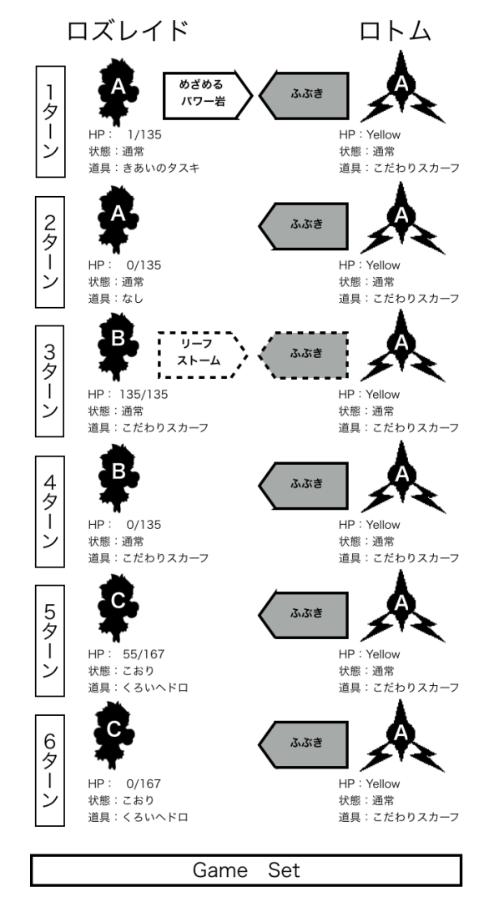
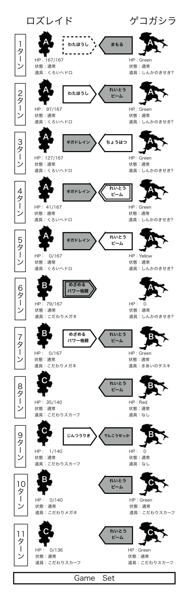
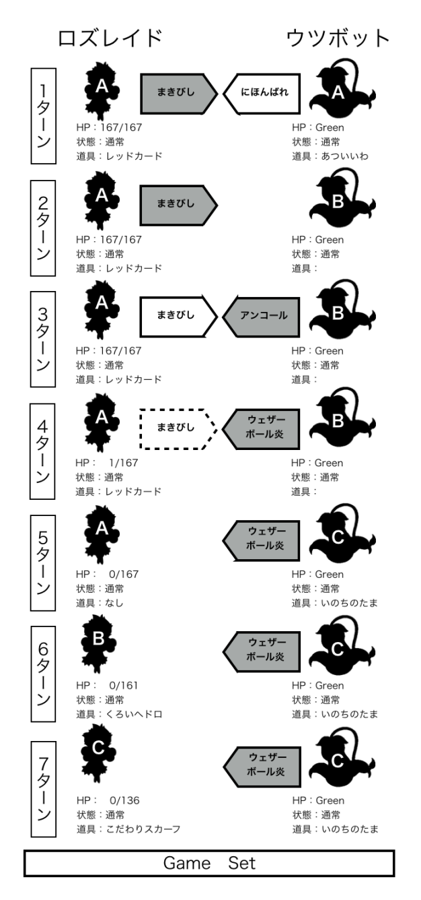

# 種族統一対戦の敗因分析と対応策の考察

###### ロズレイド統一パ　モモシロ

## 1．はじめに

種族統一という考え方は初代ポケットモンスターの頃から既に存在し，現在ほど育成環境が整っておらず手軽に対人戦が出来なかった当時の評価は「よほどヒマな人かマニア向けのルール」だったらしい．\[1\]

初め151種類だったポケモンだが，新作が発売される度に種族数は増えてゆき，現在では700種を超えた．それだけの種族がいるため，トレーナー一人一人にお気に入りの種族が出てくるのも自然な流れである．

ポケモンの世代が進むに従って育成環境が整備され，同じポケモンを複数育成することにも以前ほどの労力を必要としなくなった．さらに，ポケモンを集めること以上に対戦が主流になると，「バトルレボリューション」\[2\]や動画共有サイト\[3\]のコミュニティ等を通じた種族統一対戦会，大会が度々開かれるようになった．それらが追い風となり，種族統一戦に魅了された人の数が増加したと思われる．

著者もその種族統一戦に惹かれた一人であり，特に好きだったロズレイドで最初の統一パを構築し度々種族統一戦に挑んできた．ロズレイド統一を組んでしばらくは，時折新たな個体を加えながら，それほど勝敗を気にすることなく平穏に対戦を重ねていた．しかし，その姿勢を大きく変える契機が訪れた．最近参加したある種族統一大会で全敗を喫したのである．この大敗北の衝撃はかなり大きく，敗因分析を確実に行う必要があることを痛感した．

そこで本稿では，最近実施した種族統一戦で敗北した数戦について敗因分析を行い，今後ロズレイドで勝利を重ねていくために必要な対策を考察していく．

## 2．ロズレイド統一の概要

### (1)ロズレイドについて

ルビー，サファイア，エメラルドバージョン（いわゆる第三世代）で無進化ポケモンとして登場したロゼリアに，ダイヤモンド，パール，プラチナバージョン（いわゆる第四世代）で進化前後のポケモンが加えられた．その進化後のポケモンがロズレイドである．草と毒タイプを有するポケモンで，同複合タイプのフシギバナ，ラフレシア，ウツボットの後続に当たる．第四世代ではハクタイシティジムリーダーのナタネ様の切り札として登場し，ストーリー序盤でこのロズレイドに苦しめられたトレーナーも数多くいることであろう．

対戦面でのロズレイドの特徴を見てみよう．表1にロズレイドの種族値及び，努力値0と252の場合のステータスの実数値を示す．なお，固体値は全て31の場合と30の場合を示す．また，ロズレイドが習得可能な攻撃技と補助技を表2と表3にそれぞれ示す．

ロズレイドは，特攻の種族値が125（メガ進化後の種族を除き，草タイプ中ではナッシーと並ぶ1位，毒タイプ中ではゲンガーに次ぐ2位）と秀でていることから特殊アタッカーとして用いられることが多いポケモンである．加えて，ロズレイドの隠れ特性は「テクニシャン」であり，第6世代より威力60固定となった「めざめるパワー」と非常に相性が良くなった．「テクニシャン」を持つポケモンの中では最高の特攻種族値を持つため，他とは隔絶した威力の「めざめるパワー」を撃つことが可能である．それ故，警戒され対策される可能性が高いことには十分注意されたい．

ロズレイドは特攻面で秀でているだけでなく，特防の高さも特筆に値する．HPと特防を強化すれば，タイプ不一致であれば効果抜群の特殊技でも十分耐え得る．さらに，「やどりぎのタネ」や「ギガドレイン」を組み合わせることにより，タイプ不一致の特殊技で攻めざるを得ない相手に対する強固な防壁となる．

その一方で，HPや防御の種族値はそれぞれ60と65という低い値である．また，相手の攻撃を軽減する「ひかりのかべ」や「リフレクター」等は一切覚えないため，守りの際は自身の防御・特防力のみでしのがなければならない．

**表1.ロズレイドのステータス実数値**

| 種族値   |           | HP   | 攻撃          | 防御          | 特攻          | 特防          | 素早さ        |
| -------- | --------- | ---- | ------------- | ------------- | ------------- | ------------- | ------------- |
|          |           | 60   | 70            | 65            | 125           | 105           | 90            |
| 個体値31 | 努力値252 | 167  | 122 (134)  | 117 (128) | 177 (194) | 157 (172) | 142 (156) |
|          | 努力値0   | 135  | 90 (99)   | 85 (93)   | 145 (159) | 125 (137) | 110 (121) |
| 個体値30 | 努力値252 | 166  | 121 (133) | 116 (127) | 176 (193) | 156 (171) | 141 (155) |
|          | 努力値0   | 135  | 90 (99)   | 85 (93)   | 145 (159) | 125 (137) | 110 (121) |

**表2.ロズレイドが習得する攻撃技**

| 技名                               | タイプ     | 分類 | 威力 |
| ---------------------------------- | ---------- | ---- | ---- |
| ウェザーボール                     | ノーマル   | 特殊 | 50   |
| どくばり                           | どく       | 物理 | 15   |
| メガドレイン                       | くさ       | 特殊 | 40   |
| マジカルリーフ                     | くさ       | 特殊 | 60   |
| ベノムショック                     | どく       | 特殊 | 65   |
| めざめるパワー                     | ノーマル   | 特殊 | 60   |
| はかいこうせん                     | ノーマル   | 特殊 | 150  |
| やつあたり                         | ノーマル   | 物理 | 0    |
| ソーラービーム                     | くさ       | 特殊 | 120  |
| おんがえし                         | ノーマル   | 物理 | 0    |
| シャドーボール                     | ゴースト   | 特殊 | 80   |
| ヘドロばくだん                     | どく       | 特殊 | 90   |
| からげんき                         | ノーマル   | 物理 | 70   |
| りんしょう                         | ノーマル   | 特殊 | 60   |
| エナジーボール                     | くさ       | 特殊 | 90   |
| ギガインパクト                     | ノーマル   | 物理 | 150  |
| どくづき                           | どく       | 物理 | 80   |
| くさむすび                         | くさ       | 特殊 | 0    |
| ひみつのちから                     | ノーマル   | 特殊 | 70   |
| しぜんのちから (トライアタック) | ノーマル   | 特殊 | 80   |
| マジカルシャイン                   | フェアリー | 特殊 | 80   |
| いあいぎり                         | ノーマル   | 物理 | 50   |
| ミサイルばり                       | むし       | 物理 | 25   |
| はっぱカッター                     | くさ       | 物理 | 55   |
| じんつうりき                       | エスパー   | 特殊 | 80   |
| たねマシンガン                     | くさ       | 物理 | 25   |
| しぜんのめぐみ                     | ノーマル   | 物理 | 80   |
| タネばくだん                       | くさ       | 物理 | 80   |
| リーフストーム                     | くさ       | 特殊 | 130  |
| いびき                             | ノーマル   | 特殊 | 50   |
| ギガドレイン                       | くさ       | 特殊 | 75   |
| ほしがる                           | ノーマル   | 物理 | 60   |
| はなふぶき                         | くさ       | 物理 | 90   |
| はなびらのまい                     | くさ       | 特殊 | 120  |
| すいとる                           | くさ       | 特殊 | 20   |
| さわぐ                             | ノーマル   | 特殊 | 90   |
| れんぞくぎり                       | むし       | 物理 | 40   |
| スピードスター                     | ノーマル   | 特殊 | 60   |
| どろかけ                           | じめん     | 特殊 | 20   |

**表3.ロズレイドが習得する補助技**

| 分類                             | 技名           |
| -------------------------------- | -------------- |
| 相手の能力値が変化               | ベノムトラップ |
|                                  | あまいかおり   |
|                                  | フラッシュ     |
|                                  | いばる         |
|                                  | ないしょばなし |
|                                  | わたほうし     |
|                                  | なやみのタネ   |
|                                  | ゆうわく       |
|                                  | かげぶんしん   |
| 自分の能力値が変化               | つるぎのまい   |
|                                  | じこあんじ     |
|                                  | こころのめ     |
|                                  | せいちょう     |
| 相手を状態異常にする             | どくどく       |
|                                  | メロメロ       |
|                                  | ねむりごな     |
|                                  | どくびし       |
|                                  | くさぶえ       |
|                                  | しびれごな     |
| 回復      (状態異常の回復も含む) | ねむる         |
|                                  | こうごうせい   |
|                                  | アロマセラピー |
|                                  | やどりぎのタネ |
|                                  | ねをはる       |
| 場の変化                         | にほんばれ     |
|                                  | あまごい       |
|                                  | まきびし       |
|                                  | みずあそび     |
| 防御                             | まもる         |
|                                  | みがわり       |
|                                  | こらえる       |

###  (2) ロズレイド統一について

タイプ有利な種族や，低耐久な種族が相手の場合は，「リーフストーム」「ベノムショック」を中心とした高火力技で押し切ることが可能である．ただし，種族統一戦はタイプ不利な側は必ず延命の対策（ダメージ半減の木の実や「きあいのタスキ」等）をしているので，いたずらに攻めていると思わぬところで耐えられて手痛い反撃を受けることになるので注意が必要である．また，相手が草技を半減するタイプの場合はサブウエポンを中心に攻撃するしかない上，耐久が優秀な種族であれば攻めあぐねている間に損害が蓄積していくこともある．

前項で述べたようにロズレイドは高火力低耐久のポケモンであり，加えて素早さは激戦区の90である．素早さの種族値がロズレイドより高い，あるいは同速でも素早さ上昇の技が使用可能であり，かつタイプ相性が不利な相手ではかなり厳しい戦いになることは明白である．タイプ相性が不利で素早さがロズレイドより高く，かつ攻撃力も高い種族相手では太刀打ち出来なくなるのも事実である．ロズレイド統一では勝ち得ない種族も多数存在することを重く受け止めねばならない．

## 3．対戦戦績

ORAS発売以降に実施した種族統一戦のうち，ロズレイド統一を用いた対戦でバトルビデオが残っているものの勝敗を表4に示す．負けが目立つ．しかし，これだけ負けて悔しさも多いがそれ以上に楽しいのだから種族統一戦は不思議なものである．本稿の動機となった全敗の大会は，ボルトロス（2回目）～クチートまでの9戦である．この表に示す通りの負けた種族の中でも，特に今後種族統一戦で対戦する可能性が高い種族や，ロズレイド統一を運用するにあたり対策・克服しておくべき課題の好例となる種族について敗因分析を行う．本稿で対象としたのは，ロトム，ゲコガシラ，ウツボットとの対戦である．

**表4.著者の最近の対戦戦績**

| 対戦相手               | 勝敗 | 残りポケモン      （自分－相手） |
| ---------------------- | ---- | -------------------------------- |
| ジュカイン             | ○    | 1 － 0                           |
| ガーメイル             | ○    | 1 － 0                           |
| ボルトロス             | ●    | 0 － 1                           |
| ロズレイド             | ○    | 1 － 0                           |
| ボルトロス             | ●    | 0 － 3                           |
| サーナイト             | ●    | 0 － 2                           |
| ダストダス             | ●    | 0 － 1                           |
| ルチャブル             | ●    | 0 － 2                           |
| ムウマ                 | ●    | 0 － 2                           |
| ハリテヤマ             | ●    | 0 － 1                           |
| **ロトム(氷・飛・霊)** | ●    | **0 － 3**                       |
| **ゲコガシラ**         | ●    | **0 － 1**                       |
| クチート               | ●    | 0 － 1                           |
| ランドロス             | ●    | 0 － 2                           |
| デンリュウ             | ○    | 1 － 0                           |
| アブソル               | ●    | 0 － 2                           |
| メタモン               | ○    | 1 － 0                           |
| チラチーノ             | ●    | 0 － 1                           |
| サンダー               | ●    | 0 － 1                           |
| **ウッボット**         | ●    | **0 － 3**                       |

## 4．各対戦の敗因分析と対策

敗北した対戦の推移を整理し，敗因分析を行う．対戦の推移は模式図で図
1等の様に示す．自分と相手のポケモンそれぞれ，場に登場した順にA，B，Cと振っている．HPが0になっていないのにポケモンの記号が変わっている場合は交代したことになる．

図中の技の矢印は，グレーのほうが先制した側，破線の枠は守られたり外れたりして失敗し，二重線枠は急所に当たったことを表している．

相手のHPの実数値は不明なのでHP表示の色（Green，Yellow，Red）で表している．残りHPや状態異常はターン終了時のものを記している．また，相手の持ち物で，状況から推定したものについては「?」を記し，不明なものは空欄である．

なお，これ以降の対策の考察で「めざめるパワー」を使うロズレイドの特性は全て「テクニシャン」を前提とする．ダメージ計算の結果は，全て「ポケモントレーナー天国」の計算ツール\[4\]の結果である．

### (1)対ロトム

#### a)対戦前の行動指針

・選出される可能性が高いヒート，フロスト，スピンロトム（以下，まとめて3フォルムと言う）全てに刺さる「めざめるパワー（岩）」で攻撃

・特殊耐久型で「くろいヘドロ」と「ギガドレイン」を組み合わせ，ヒート，フロスト以外のフォルムに抵抗

・タイプ不利なフォルムが一掃されたことを前提に，特殊アタッカーで決着

#### b)戦闘経過

対ロトムの戦闘経過を図1に示す．初手で相手が選出したのはフロストロトムであった．そのフロストロトムに1ターン目から「ふぶき」を撃たれ続けた．こちらは「きあいのタスキ」で堪えて「めざめるパワー（岩）」で応戦したり，「こだわりスカーフ」で先手を取ることを試みたりするも，相手の素早さを抜くことは出来ずに一気に崩壊した．さらに，当てなければ倒されるという場面で「リーフストーム」を外したり，特殊耐久寄りのロズレイドCが「ふぶき」を耐え切り「ギガドレイン」で反攻しようとすれば凍り状態になったりと，運にも見放され，あっという間に敗北である．

#### c)敗因

相手からすれば，特攻の高いロズレイドに先手を取られて大ダメージを受ける前に，有利なタイプのフォルムで先制攻撃し一気に主導権を握りたいところであろう．タイプで有利な3フォルムであるが，ヒートロトムの「オーバーヒート」は大ダメージが期待できるものの特攻が低下してしまうため連打が出来ず，スピンロトムの「エアスラッシュ」では威力不足の可能性がある（HD全振りのロズレイドの場合，性格補正なしでも被ダメージ率は最大68.2%であり，相手からすれば無駄にロズレイドに行動回数を与えてしまう恐れがある）．以上のことから，相手は初手にフロストロトムを選択したと推測する．事実ロズレイド側からしても，当たる限り確実に大ダメージを受け，かつ凍り状態が追加され得る「ふぶき」を連打されると厳しい戦いになる．そして，この対戦ではそれを許して惨たんたる結果になってしまったのである．

唯一「ふぶき」を持ち物の効果なしで耐えたロズレイドCが受けたダメージから逆算すると，相手のフロストロトムは「こだわりメガネ」ではなく，（ロトムの特攻252振りを仮定した場合．性格による素早さ補正がなければロズレイドAの素早さを抜くことが出来ない．）「こだわりスカーフ」を持っていたと推定できる．初手から一気に攻勢をかけて主導権を取りにきていたのである．

そもそも，初手に弱点3タイプを突ける「めざめるパワー」岩を搭載したロズレイドAを出したとはいえ，その特性は「テクニシャン」ではなかった．過去世代で育成したロズレイドであったが，それで通用すると思っていた著者の驕りが最大の敗因である．

**図 1．対ロトム戦の戦闘経過**

#### d)対策の考察①

ロトムはフォルムチェンジにより様々なタイプになることが出来るため，フォルムチェンジ個体をパーティーに入れることが可能な（その様な場合は，6匹のフォルムの重複を禁止するルールが多い）ため，種族統一戦では割と多く採用される種族である．当然，こちらの弱点をタイプ一致で突いてくるので，種族統一戦ではロトム対策が極めて重要となる．

このロトム戦では，初手に最速ロズレイドを投入していれば先制攻撃が可能であった．しかし，最速の場合では特攻全振りで「リーフストーム」を撃っても，特防耐久無振りでもフロストロトムに対するダメージ率は最大96%と倒し切ることが出来ず逆襲されてしまう．

そこで，あえて先制には拘らずに，「きあいのタスキ」持ちロズレイドを選出する．さらに，このロズレイドには「めざめるパワー（岩）」と「わたほうし」を搭載しておく．努力値はCS全振りで素早さ上昇の性格が望ましい．相手が「こだわりスカーフ」を持っていれば当然先制されるが，慌てずに「きあいのタスキ」で耐えて「わたほうし」を撃つ．これでロズレイドの方が先行出来るので「めざめるパワー（岩）」で攻撃を加える（相手がフロストの場合は「リーフストーム」も有効で，乱数1発37.5%である）．これで先発ロズレイドが倒れても次へと繋げる．

後続で望ましいのは「こだわりメガネ」を持たせたアタッカーである．「こだわりメガネ」持ちの場合，特攻に努力値を最低92振れば，HP特防無振りフロストロトムを「めざめるパワー（岩）」で確定1発（最小ダメージ率102%）で倒すことが出来る．相手が耐久より攻撃を重視したアタッカーを選出する可能性が高い場合には有効であると言える．さらに，素早さにも全て振って性格補正で素早さを上げておけば，相手の「こだわりスカーフ」持ちの1匹目を倒した後は必ず先制出来るので有利である．「めざめるパワー（岩）」を採用した場合，素早さの固体値は最高でも30となることに要注意だが，それでも素早さ全振りで性格補正込だとフォルムチェンジロトムに勝っている．

#### e)対策の考察②

ロズレイドが注意すべき技は相手の攻撃技だけではない．ロトムはいずれのフォルムでも「ひかりのかべ」を使用可能であり，一度壁を貼られてしまえば，いくら高火力で攻撃を仕掛けても大ダメージを与えられずに逆襲されてしまう．「ひかりのかべ」を貼られた場合に慌てて攻めるのは好手とは言えない．「ひかりのかべ」を貼られることを極力避けなければならないが，それはかなり困難であろう．その場合は，技構成「やどりぎのタネ」「どくどく」「まもる」「みがわり」（「みがわり」の代わりに「わたほうし」でも良い）の特殊耐久ロズレイドで「ひかりのかべ」が切れるのを待つのが最善であると考えられる．以下，このロズレイドを「時間稼ぎ型」と呼ぶ．「やどりぎのタネ」「どくどく」「わたほうし」等を重ねて撃ち込まれた相手は高確率で別のポケモンに交代すると思われるので，さらに「どくどく」をタイミング良く使ってより多くの相手を毒状態に出来る（アタッカーロズレイドの「ベノムショック」に繋げるため）と理想である．

次に，相手が「ひかりのかべ」を搭載したロトムを選出してくる状況を考える．「ひかりのかべ」を貼るロトムには「こだわりスカーフ」や「こだわりメガネ」といった持ち物を持たせるとは考えにくいことから，「ひかりのかべ」を使うのはアタッカーではない．加えて，「こだわりスカーフ」を持てない状態であるので持ち物なしの素早さ対決では素早さ全振り性格補正込ロズレイドに敵わないことから，いたずらに3フォルムを出しても余計なダメージを受けて最悪貴重な戦力を失う可能性もある．したがって，ロトムが「ひかりのかべ」を使う場合は3フォルム以外のフォルムであると予想される．

#### f)ロトム対策のまとめ

ロトムを相手にした場合は，「こだわりスカーフ」を持ったアタッカーか「ひかりのかべ」を使う補助型が初手で選出される可能性が高いため，このどちらかを見極める必要がある．ロズレイドは初めに，「きあいのタスキ」持ちの攻撃重視型を出しておき，相手が3フォルム以外なら「ひかりのかべ」を使われると判断して「時間稼ぎ型」に交代する．

ただし，耐久型で補助技しか持たないロズレイドを選出する場合は，他の2匹を倒されて攻撃手段がなくなることを避けなければならない．実際，著者が表4のアブソルと対戦した時は，攻撃技なしの物理耐久型だけが残り，非常に苦しい持久戦を強いられることになった．

「こだわりスカーフ」持ちには「きあいのタスキ」持ちを，「ひかりのかべ」使いには「時間稼ぎ型」を，それ以外には素早さ特化「こだわりメガネ」持ちを，それぞれぶつけていく戦い方を軸に勝利を掴みたい．

### (2)対ゲコガシラ

#### a\) 対戦前の行動指針

・特性でタイプ一致となった「れいとうビーム」を特殊耐久型で耐えて「めざめるパワー」で攻撃

・相手が水タイプのうちに「こだわりスカーフ」持ち特殊アタッカーで「リーフストーム」攻撃

#### b)戦闘推移

対ゲコガシラの戦闘経過を図
2に示す．初手で物理と特殊の両方にある程度耐えられるようにしたロズレイドAで「わたほうし」を使い，「ギガドレイン」で徐々に相手の体力を削っていった．ゲコガシラAのほうは，こちらの予想通り「れいとうビーム」を主体に攻めてきたので，後続のロズレイドBの追撃もあり，両者の初手のポケモンは共に倒れ残り2対2となる．その後，「めざめるパワー（格闘）」で攻撃する型や，「こだわりスカーフ」の特殊アタッカーで攻めて互いにラスト1匹になるが，先制で撃たれ続けるタイプ一致「れいとうビーム」に敵わず敗北した．

#### c)敗因

確かに「れいとうビーム」を使って氷タイプになった相手の弱点を突くことは出来た．しかし，その後にタイプ変化後のゲコガシラに有効な「めざめるパワー」を使えるロズレイドを続けて投入していかないのが痛手であった．投入しなかったと言うより，「めざめるパワー」を使えるロズレイドを十分な数育成していなかったので投入出来なかった．やはり，種族統一戦は様々な状況に対応可能な型の育成数が物を言う．今回の対戦は完全に敵を過小評価していたために敗北に至ったと言わざるを得ない．また，耐久型とアタッカーを選出する順番も芳しくなく，高火力の特殊アタッカーを活かすことが出来ずに終わった．

#### d)対策の考察①

ゲコガシラの「へんげんじざい」によるタイプ一致攻撃は極めて強力であり，ロズレイド統一に限らずどの種族にとっても対策が必要である．

対「へんげんじざい」戦では相手のタイプ変化後の弱点を突くのが基本となる．ロズレイドの場合は，相手が頻繁に撃つであろう「れいとうビーム」を耐えて氷タイプになった相手に「めざめるパワー（岩）」を撃ち込む．「めざめるパワー」のタイプを岩としたのは，ゲコガシラが「アクロバット」も使用可能であるためである．また，特攻の固体値を31にすることが出来るため最大のダメージを与えられる（敗戦例のように「めざめるパワー（格闘）」では特攻の固体値は最高30）．また「じんつうりき」で攻撃された場合も想定し，「シャドーボール」も搭載しておくことが望ましい．ただし，「シャドーボール」を入れるのは「めざめるパワー（岩）」と両立するためであるから，特にエスパー状態に対してピンポイントで対抗したい場合は「めざめるパワー（ゴースト）」や「めざめるパワー（悪）」を採用することも十分考えられる．しかし，相手の弱点を突けるとはいえ一撃で倒せる可能性は高くない．2発目の相手の攻撃を受けてもなお耐えられるよう，特殊耐久か「とつげきチョッキ」を持たせた個体が必要となる．

今対戦の初手で出したロズレイドAは特攻に30振っただけの耐久型である．ロズレイドAの「ギガドレイン」で相手に与えたダメージから推定すると，ゲコガシラAは「しんかのきせき」を持っていた可能性がある．また，最後のゲコガシラCは「こだわりスカーフ」を持っていたと推定され，最後の素早さ対決はゲコガシラに軍配が上がったと考えられる．初めに耐久型を出し，徐々に攻勢をかけてきたと言える．

また，今回「めざめるパワー（格闘）」を撃ったロズレイドBは，「こだわりメガネ」を一時的に持たせていたとは言え，本来は耐久寄りの型であり，特性も「テクニシャン」ではなかった（隠れ特性が解禁されていない時に育成したロズレイド）．それでも，ゲコガシラBを一発で「きあいのタスキ」耐えにするダメージを与えることが出来た．

これらを考慮すると対ゲコガシラの場合，ロズレイドは無理に先制を狙うよりも，耐久を重視していくのが良策である．勝てる見込みが少ない素早さで勝負するよりも，こちらの攻撃をより多く当てていくことが重要である．相手が極度に硬い訳ではないので，特攻に全振りしなくても中～大ダメージを期待出来る．もちろん，相手のタイプが水のうちに「こだわりスカーフ」で先制草技を撃つことが必要な場合もあるが，相手が最後まで「こだわりスカーフ」型を温存するとすれば，素早さ対決を避けるためにもロズレイドの「こだわりスカーフ」型は中盤ぐらいに出すと良いかもしれない．

**図 2.対ゲコガシラ戦の戦闘経過**

#### e)対策の考察②

今回対戦したのはゲコガシラであるが，ここでは危険側の評価という意味でも，同じく特性「へんげんじざい」を持つ進化後のゲッコウガを対象に考察を進める．実際に戦った訳ではないので，ロズレイドに対して選出されると予想されるゲッコウガの型の中でも特に注意したい2種類を想定し，それぞれの型への対処を考察する．ただし，それらの型が選出されると分かっていることを前提として考察を進めている点に注意．

##### ・「れいとうビーム」「ふぶき」型

氷タイプとなり「れいとうビーム」や「ふぶき」で攻めてくる型である．恐らくロズレイド相手に最も多く選出される型の一つであろう．「ふぶき」は命中率に難があり，外したところに「リーフストーム」が入ればゲッコウガ側も大ダメージを受ける可能性があることを考えると「れいとうビーム」のほうが採用されやすいと思われる．ただ，ここではより危険な「ふぶき」を考えることにする．

ロズレイドはHD全振りで性格補正込，「とつげきチョッキ」を持っているとする．ゲッコウガが特攻特化で「こだわりメガネ」を持ち「ふぶき」を使うと，最大ダメージは146であり，ロズレイドの残りHPは21となる．これに対しロズレイドは「ギガドレイン」で対抗するが期待出来るダメージは最大81（乱数2発），回復量は40であり，到底一体だけでは止められない．したがって，相手が「こだわりメガネ」の場合は諦めて「きあいのタスキ」で耐えて「リーフストーム」を撃つ．相手が「こだわりメガネ」を持っていない場合は特防特化ロズレイド「とつげきチョッキ」持ちで最大ダメージ98（ダメージ率58.6%，確定2発）なのでぎりぎり2回「ギガドレイン」を使うことが可能で，運が良ければ相手を倒せる．

##### ・空襲型

「しろいハーブ」を持ち「とびはねる」を行った後に「アクロバット」を続けざまに撃つ．この型は非常に危険である．序盤で決められてしまうと一気に3タテされることもあり得る．

HB全振り性格補正込の物理耐久ロズレイドであれば，相手が攻撃特化の場合でも確定2発（ダメージ率87.4%）に抑えられる．後攻で「わたほうし」により相手の素早さを下げ，次のターンで1発攻撃を加えておく（無理に「めざめるパワー」でなくても良い）．その次に「こだわりスカーフ」アタッカーで「ヘドロばくだん」等で追撃する（ここで「めざめるパワー」電気だと面白いことになりそう）．次に出てくるゲッコウガが「こだわりスカーフ」でなければもう1発ダメージを与えられる．最初のゲッコウガが「わたほうし」を受けているので，2体目のロズレイドが先制したとしても「こだわりスカーフ」ではないだろうと相手が予想してくれることを期待しよう．「アクロバット」を使われる前に倒さなければならない．

#### f)ゲコガシラ、ゲッコウガ対策のまとめ

相手はロズレイドよりも素早さが高く（ゲコガシラはS97，ゲッコウガはS122），「こだわりスカーフ」でも持たない限り，弱点タイプの技を先制されるのは覚悟の上である．幸い相手の耐久がそれほど高くないこともあり，特攻無振りであっても「ヘドロばくだん」「めざめるパワー」等のサブウエポンで大抵確定2発で落とせる．対ゲコガシラ，ゲッコウガ戦においては，相手の攻撃を耐えつついかに攻撃の回数を稼ぐかにかかっていると思われる．それでも勝てない場合は，「ひかりのこな」を持たせて祈るなり，「メロメロ」「しびれごな」「じんつうりき」で行動を封殺するなり，本当の最終手段として「ねむりごな」を無差別乱射するなりしてください（複数催眠が禁止されている場合は駄目である）．

### (3)対ウツボット

#### a)対戦前の行動指針

・「まきびし」を撒けるだけ撒き，相手の「きあいのタスキ」を無効化

・「ヘドロばくだん」搭載個体で中程度のダメージを与える

・手負いの相手を特殊アタッカーの「じんつうりき」で掃討

#### b)戦闘経過

対ウツボットの戦闘経過を図3に示す．行動指針の通り初手で「まきびし」を撒くと相手が「にほんばれ」で場を晴れ状態にした．その後，相手は交代してきたので，さらに無傷で「まきびし」を撒き続ける．悠長に3回「まきびし」を撒いたところで「アンコール」をうけるが，ここは引く必要はないと思い，あえて失敗する「まきびし」を続けて様子を見た．その直後，ウツボットBが炎タイプとなった「ウェザーボール」を撃ち込んできたのである．ウツボットに「ウェザーボール」があったのを思い出した時には既に勝負は決まっており，「ウェザーボール（炎）」の嵐の前になす術なく全滅した．

**図 3．対ウツボット戦の戦闘経過**

#### c)敗因

負けの最大の原因は晴れ状態での特性「ようりょくそ」で常に先制攻撃を許してしまったことである．ロズレイドも「にほんばれ」と「ウェザーボール」を組み合わせた攻撃が可能であり，「めざめるパワー（炎）」では威力不足になりがちな相手や，対鋼タイプ等に用いられる常套手段であるが，今回のように相手が「ウェザーボール」を使用可能かつ特性「ようりょくそ」を持つ種族の場合は迂闊に晴れ状態にすることは出来ない．さらに，草タイプには「しびれごな」「わたほうし」が無効となるため，「ようりょくそ」によりステータスが2倍になった相手の素早さを下げることは出来なくなる．

著者は，ウツボットが「ウェザーボール」を習得可能なことを完全に失念していた．知識不足が祟った典型的な負け戦である．

#### d)対策の考察①

先制して「じんつうりき」や「めざめるパワー（炎）」等を急所に当て続け3タテでもしない限り，ウツボットに「にほんばれ」を使われるのを避けることは出来ないが，それは中々厳しい．しかし，「ようりょくそ」で2倍になった相手の素早さを下げる術がないからといって一方的に攻められ続けるわけにはいかない．手段は一つ，「にほんばれ」を使われたら直ぐに「あまごい」で雨にしてしまうことである．幸い，ウツボットがロズレイドの弱点を突ける技は「ウェザーボール（炎）」のみである．しかし，「あまごい」を使用しても相手が執拗に「にほんばれ」で晴らせてくる場合には，「みずあそび」で炎技の威力を1/3にするのが有効である．「みずあそび」を使えば，例え晴れ状態であっても，性格補正込特攻全振り「こだわりメガネ」ウツボットの「ウェザーボール」のダメージ率は最大でも68%に抑えられる．（ロズレイドはHP，特防無振りにも関わらず）逆に，晴れ状態であることを利用し「こうごうせい」で回復しつつ，「せいちょう」で特攻を2段階上昇させ「じんつうりき」を見舞うことが可能である．切り札の一つである「ウェザーボール」を封じられても「じんつうりき」で攻めることが可能であるというロズレイドの利を活かして上手く立ち回りたいところである．

#### e)対策の考察②

ここまでは相手の特性が「ようりょくそ」の場合について考察してきたが，隠れ特性の「くいしんぼう」を活用した型が選出される可能性もある．「くいしんぼう」の場合に有効な手段として，「カムラのみ」を早めに食べた後の「ゲップ」や，「オボンのみ」で回復しつつ「たくわえる」を積み上げて「はきだす」（最高威力300）等が挙げられる．前者の場合でロズレイドが受けるダメージは特防耐久無振りでもダメージ率80%であるのに対し，後者の場合はHPと特防無振りで確定1発，HP60振りと特防全振りかHP全振りと特防68振りでようやく確定2発になる程の破壊力である．ロズレイドは「じんつうりき」や「にほんばれ」「ウェザーボール」（「ようりょくそ」個体に交換されるリスクを恐れなければ）等で攻めたいところであるが，「たくわえる」で相手の特防が上昇していくと決定打に欠く．攻めあぐねている隙に「はきだす」で大ダメージを与えられかねない．この場合にロズレイドが採るべき策は「じこあんじ」により自身も特防を上げてしまうことであろう．相手は「はきだす」或いは「のみこむ」を使って特防が元に戻るが，ロズレイドの方は上昇補正を維持できる．少なくとも特防上昇を1回コピーしておけば，耐久無振りであっても威力300の「はきだす」を耐えられる．相手が「いのちのたま」持ちの場合を警戒して2回コピーしておくとなお良い．

#### f)ウツボット対策のまとめ

ロズレイドにとって本来有利な条件になりやすい晴れ状態であるが，対ウツボットに関しては，自ら「にほんばれ」を使うのは自爆行為に等しい．ロズレイドにとっては優秀なサブウエポン（メインと言っても過言ではない）を封じられることになる．ただし，相手の有効打が「ウェザーボール（炎）」だけであるから，その技を使われるのを防ぐ，あるいは軽減することだけに集中すればよい．攻撃範囲ではロズレイドが有利なので，相手の主砲を封じている間に一気に勝負を決めたい．なお，「じこあんじ」で「たくわえる」の効果はコピー出来るが，「ようりょくそ」の素早さ上昇はコピー出来ないので要注意である．

## 5．おわりに

これまでに示した各種族の対策案を見ても分かるように，それぞれの種族を相手にする毎に，ロズレイドの個々の役割や技構成は大きく異なる．つまり，相手の種族対策に特化したロズレイドをその都度育成しなければならない．種族統一戦は，会い見える種族間の総力戦であるから，常に仮想敵を設定して徹底的にその相手の対策を行うべきである，というのが著者の見解である．

種族統一戦においては勝負を運に任せなければ勝てない相手，運に任せても勝ち得ない相手がいるというのは避けようのない事実である．多かれ少なかれ，絶対に勝ち得ない種族はどの種族にも共通して存在し，それらの壁に立ちはだかられるのは種族統一戦に身を投じた者の宿命である．それでも地道に相手が採り得る危険な行動を予測しそれを実行させない策を考案する，ひたすらこの繰返しである．もちろんそれだけでは机上論に過ぎないので，実戦を重ねて策を改良していく必要がある．

本稿の考察ではかなり強引に対策を立てた面もあるが，相手の採り得る手段を多く予想しておくに越したことはなく，勝利への一番の近道であろう．もちろん，今回示した種族以外にも考察を加えたい．

最後に，本稿が今後ロズレイド統一を動かしたい方の参考となれば幸いである．

## 参考文献

\[1\] "ポケットモンスター赤・緑・青必勝攻略法"，ファイティングスタジオ，1997

\[2\] "ポケモンバトルレボリューション"， 任天堂， http://www.nintendo.co.jp/wii/rpbj/ ，2006

\[3\] "ニコニコ動画"， http://www.nicovideo.jp/

\[4\] "ポケモントレーナー天国"， http://pokemon-trainer.net/
