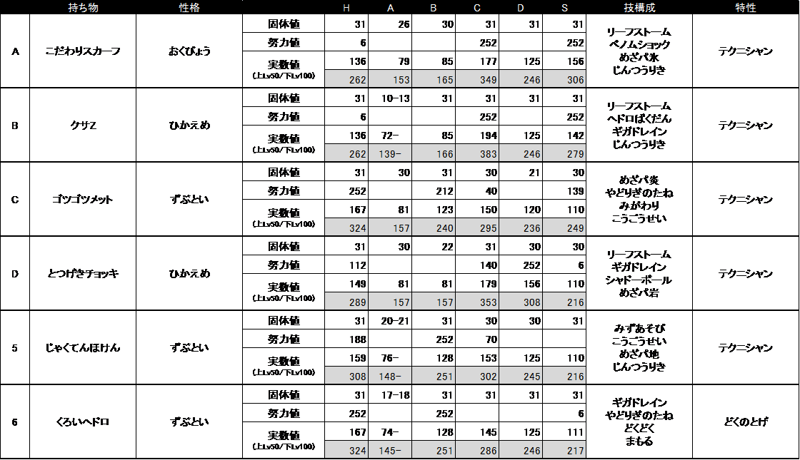
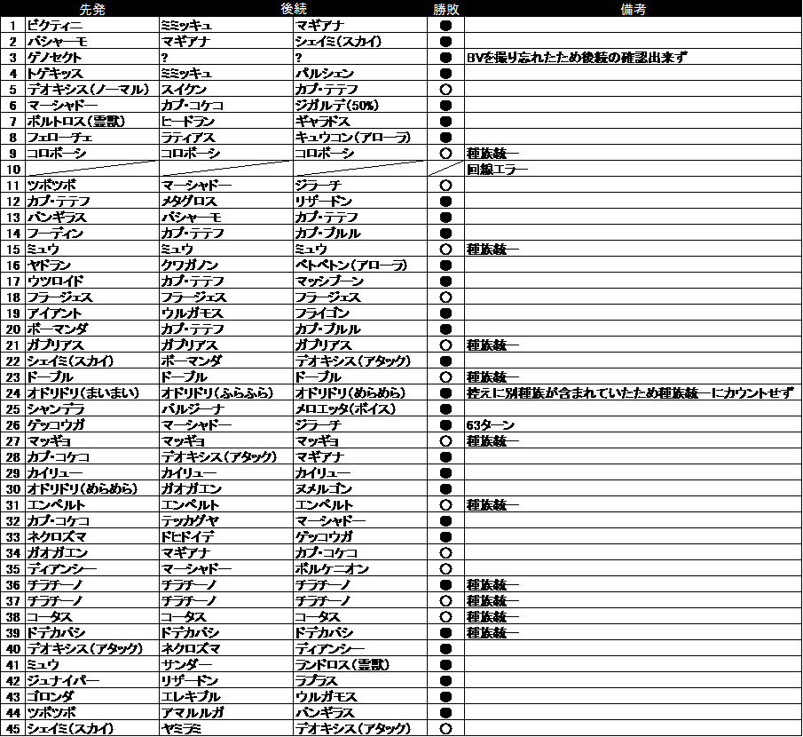

# シャドースチール大会におけるロズレイド統一の戦闘記録

###### ロズレイド統一パ　モモシロ

## 1．はじめに

2017年8月25日から28日までの期間，公式のインターネット大会の一つであるシャドースチール大会が開催された．シャドースチール大会は，ポケットモンスターサン・ムーン（第7世代）において，ポケモン重複，道具重複，伝説ポケモン使用の3大禁忌事項が全て認められる「何でもあり」ルールが適用された大会である．特筆すべきは，初めて公式戦で「ポケモンの重複」が許された点であり，種族統一戦愛好者の間では大会前から話題となっていた．大会後の種族統一有志の方の集計によると，少なくとも160種の種族統一パの参戦が確認されている．著者も相変わらず使い続けているロズレイド統一で参戦した．

今大会に限らず，公式大会では予めパーティーを登録しておく必要があり，大会参加中はパーティーの変更が出来ない．最初に選出した6匹だけで他の種族統一パは勿論のこと，高レートを目指している情け容赦ない普通パまで幅広く戦い抜かなければならない．その様な極限状態の戦場に満を持して送り出したロズレイド達の型を表
1に示す．

**表1　登録したロズレイド統一**

## 2．参戦したロズレイド統一

今大会には，比較的耐久寄りの個体を多めに入れた．大会のルール上道具の重複は可能であるが，そもそも種族統一パで道具を重複させるのは個人的な心情として面白みがないため御法度としており，すべて異なる道具を持たせている．また，比較的耐久が低いとされているロズレイドであるが，今大会ではあえて「きあいのタスキ」は持たせなかった．

### a)ロズレイドA

最速の特殊アタッカー型である．「ベノムショック」は適宜「ヘドロばくだん」と切り替えている．今大会では「ヘドロばくだん」にしておけば良かったという場面が多々あったが，代わりに「めざめるパワー（氷）」でガブリアスやスカイフォルムシェイミを多く沈めることが出来たので良し．

### b)ロズレイドB

通常は「こだわりメガネ」を持たせている最大火力の特殊アタッカー型である．今大会ではパーティー固定であることを鑑み，柔軟に撃ち分けが可能となるように「クサZ」を待たせた．「こいつ倒せないとやばいけど，残りHPが多すぎる！」という場面を強行突破する主砲として活躍した．

### c)ロズレイドC

「めざめるパワー（炎）」搭載で，草・毒では戦いにくいハッサムを仮想敵としている型である．しかし，残念なことに今大会ではハッサムはおろか，「めざめるパワー（炎）」で4倍弱点を突ける複合タイプの相手は全く来なかった．一方で，物理耐久と「ゴツゴツメット」の組み合わせにより，今大会で頻繁に現れたマーシャドーに対して予想以上の活躍を見せた．

### d)ロズレイドD

ロズレイドの前に現れる不届き千万なゲッコウガを駆逐する型である．「れいとうビーム」を撃って氷タイプになった相手を「めざめるパワー（岩）」で叩く．今大会ではゲッコウガとの対面はほとんどなかった（一回だけ「いのちのたま」持ちと相討ちになった）が，交代で出てきたウルガモスに偶然選択していた「めざめるパワー（岩）」が入るというおいしい場面もあった．

### e)ロズレイドE

ロズレイドの前に現れる不届き千万なバシャーモを駆逐する型である．バシャーモと対峙した時の流れは概ね次の通りである．大抵初手で「まもる」を使ってくるのでその間に「みずあそび」→弱体化した炎技を受け「じゃくてんほけん」発動→「めざめるパワー（地）」や「じんつうりき」で逆襲（今大会でも成功．ただし，初手でバシャーモが出てこないと厳しくなる）．また，万一のことを考え，攻撃努力値全振り+上昇補正ありのバシャーモに「ブレイブバード」を使われても最大99.3%のダメージで耐え切る調整をしている．仮想敵のバシャーモ以外にも，ロズレイドより遅い炎タイプに出しやすい．余談であるが，全く同じ技構成と持ち物で特防を調整した対ヒードラン用として育成したロズレイドもいる．

### f)ロズレイドF

　物理耐久に特化した型である．ロズレイドは防御が低いというのが通説であるが，タイプ一致で弱点を突かれなければ意外と余裕を持って耐え，「やどりぎのタネ」等で相手の流れを乱す良い働きを見せてくれる．相手の初動が不明で，様子を見たい時に出すことも多い．育成した当初に予想していた以上に活躍の場が多く，著者としては積極的に布教していきたいところである．

## 3．対戦成績

今大会のロズレイド統一の戦績をまとめる．対普通パの戦績は5勝27敗（回線エラーによる中断1回）で勝率15.6%，対種族統一パの戦績は9勝3敗で勝率75.0%であり，普通パと種族統一パ全てを含めた総合戦績は14勝30敗（回線エラーによる中断1回）で勝率は31.8%であった．トレーナーランキングは全参加者14,469人中14,296位，最終レートは1,342であった．本論文の最後に付録として，対戦した全てのポケモンを示す．

## 4．対普通パとの対戦総括

このシャドースチール大会は，「ポケモンバトルレボリューション」以降，ポケモン本編にランダム対戦が実装されてから初めて種族統一パと普通パがランダム対戦出来る機会となった．現時点では，ランダム対戦でポケモン重複が許されない環境において種族統一戦を行う場合はどうしても種族統一パ同士の対戦がほとんどとなる．その様な経緯もあり，本項では特に，シャドースチール大会における普通パとの対戦についてまとめた．なお，対種族統一パとの戦闘詳細は自身のブロマガ\[1\]に書き散らしているので，時間を持て余して仕方ないと言う方にご参照頂きたい．

ロズレイドに対して選出されたポケモンを回数別に整理し，上位5位までのポケモン（表2）について対戦所感を記す．なお，種族統一パとしてマッチングした種族は数に含めていない．

**表 2　選出された回数上位のポケモン**

| 順位 | ポケモン名                | 回数 |
| ---- | ------------------------- | ---- |
| 1    | カプ・テテフ              | 6    |
| 2    | マーシャドー              | 5    |
| 3    | カプ・コケコ              | 4    |
| 3    | デオキシス   （アタック） | 4    |
| 3    | マギアナ                  | 4    |

### a)対カプ・テテフについて

エスパータイプで特攻の種族値が130と極めて高く，素早さの種族値もロズレイドより5高い95であることから，対ロズレイドとして最も多く選出された．一応ロズレイド側も毒技で弱点を突けるが，素早さ勝負では不利である．今のところ対応の術なし．

### b)対マーシャドーについて

「シャドースチール」が名前になっている大会だけあり，マーシャドーとの対戦回数はかなり多かった．「シャドースチール」は，相手の能力が上昇している場合に，その上昇分を0に戻すばかりか自分の能力上昇分にしてしまうという極めて強力かつ技巧的な技であり，威力も90と高い方である．しかし，悲しいかなロズレイドは能力上昇の技をほとんど覚えないため，皮肉にも能力上昇を逆手に取られることもなくそれ程脅威ではなかった．むしろ，「ゴツゴツメット」持ちの物理耐久型であるロズレイドCが良く刺さった．

### c)対カプ・コケコについて

何故カプ・コケコが選出上位にいるのかよく分からない．特にロズレイド側が警戒すべきは「つばめがえし」や「アクロバット」などの飛行技であるが，タイプ不一致であるし物理耐久型で十分対応可能に思える．実際のところ飛行技はあまり撃たれていない．

### d)対デオキシスについて

先手さえ取られなければロズレイドの火力で十分薙ぎ払える．ただし，通常は素早さで負けるため，こちらは「こだわりスカーフ」が必須となる．最終45戦目のラストでデオキシス（アタック）が出てきた際には，ロズレイドAが「リーフストーム」で粉砕し勝利を収めた．

### e)対マギアナについて

はがね・フェアリー複合タイプであり，まともに攻めるには「めざめるパワー（炎）」か「めざめるパワー（地）」ぐらいしかない．「れいとうビーム」を撃たれることが多かったため，受け切って「じゃくてんほけん」を発動させて逆襲するのが最善か．攻撃に転じなくとも，特性「ソウルハート」さえ警戒しておけば，特殊耐久型で対処出来そうではある．

## 5．対戦の詳細な分析

今大会で敗北した対戦については速やかな対応策を検討することが必要なのは勿論であるが，勝利した対戦についてもそれで終わりとするのではなく，状況を整理し勝利が妥当なものだったのか辛勝だったのかを評価することが重要であり，今後ロズレイド統一パを運用していく上でも参考になる．

具体的には，今大会でいくつか勝利した対戦を示し，実戦の被ダメージや与ダメージから相手の努力値振りなどを推定し，戦闘の状況を整理する．特に今回は，勝利した対戦の中でも比較的接戦と思われる2試合を取り上げた．

ステータス計算，ダメージ計算に用いている式\[2\]は以下の通りである．

ステータス（HP）の計算

Status = {(2S+I+E/4) ×L/100}+10+L

ステータス（HP以外）の計算

Status = {(2S+I+E/4) ×L/100+5}×α

ダメージの計算

Damage = {(2L~a~/5+2)×P×A~a~/A~d~/50+2}×β×T~m~×T~c~

ここに，L：レベル，I：個体値，E：努力値，α：性格補正値（0.9, 1.0,
1.1），L~a~：攻撃側のレベル，P：技の威力，A~a~：攻撃側の能力値，A~d~：防御側の能力値，β：乱数（0.85〜1.0），T~m~：タイプ一致補正値（1.0,
1.5），T~c~：タイプ相性補正値（0.25, 0.5, 2.0, 4.0）を示している．

### (1)ツボツボ，マーシャドー，ジラーチとの戦い

#### a)戦闘推移

第11戦目の普通パとの戦いで，ロズレイドはF,C,Eを選出した．ツボツボは「ステルスロック」「ねばねばネット」でこちらの撹乱を図ってきた．ロズレイドCは「やどりぎのタネ」や「めざめるパワー（炎）」を，ツボツボは「がんせきふうじ」や「アンコール」を駆使し，数ターン膠着状態が続くがロズレイドが競り勝つ．次のマーシャドーは最初に「みがわり」を使いつつ「シャドースチール」で攻撃してきたが，ロズレイドCの「ゴツゴツメット」でダメージが蓄積する．ロズレイドCはZ「シャドースチール」で倒されるものの，後続の物理耐久ロズレイドFで引き続きマーシャドーにプレッシャーを与え続けて倒した．最後に出てきたジラーチの「しねんのずつき」でロズレイドFが倒され窮地に陥るも，ロズレイドEが「しねんのずつき」を耐え「じゃくてんほけん」が発動し，特攻が2段階上昇した状態での「めざめるパワー（地）」で逆襲し勝利した．

#### b)相手の努力値振りの推定

以下に示す戦闘の状況から相手のポケモンの努力値振りを推定した．

・ツボツボの「がんせきふうじ」を複数回受け，ロズレイドFは15，16ダメージを受ける．

・ツボツボに対する「やどりぎのタネ」により，ロズレイドFのHPが284→314（+30）に回復する．

・マーシャドーの「シャドースチール」を受け，ロズレイドCのHPが315→173（-142）となり，ロズレイドFのHPが284→130（-154），231→96（-135）となる．

・ロズレイドFの「ギガドレイン」でマーシャドーにダメージを与え，HPが130→191（+61）に回復する．

・ジラーチの「しねんのずつき」を受け，ロズレイドEのHPが270→64（-206）となる．

ツボツボは攻撃の個体値が31の場合は努力値を振らなくとも，「がんせきふうじ」でロズレイドFに最低16ダメージは与えられるはずであるが，今回の戦闘ではそれを下回ることもあった．したがって，このツボツボの攻撃個体値は31より小さく，攻撃を重視して努力値を振っていたとは考えにくい．また，「やどりぎのタネ」は相手の最大HPの1/8を吸収しそのまま自分の回復量にすることから，ツボツボの最大HPは240〜244（8で割り小数点以下を切り捨てると30になる範囲）と推定出来る．これは，HP個体値27〜31において努力値を全振りした場合に相当する実数値の範囲であるが，今回はHPに個体値31で努力値を全て振っていたと仮定する．

マーシャドーは，ロズレイドC,Fの被ダメージから推定すると攻撃個体値31，努力値全振り，性格補正なしと推定出来る．また，「ギガドレイン」は相手に与えたダメージの半分を自分の回復量にすることから，ロズレイドFはマーシャドーに122ダメージを与えたことになる．この場合，マーシャドーはHPと特防に努力値を振っていないこととなり，その代わりとして素早さに努力値を全振りし性格は攻撃の下降補正とならない「ようき」であると推定出来る．

ジラーチは，ロズレイドEの被ダメージから推定すると，努力値全振りの性格上昇補正なし（206〜246ダメージ）が最有力であると考えられる．なお，攻撃に努力値無振りかつ性格上昇補正なしでも，「こだわりハチマキ」を持っているとロズレイドEは最低242ダメージを受けるはずなので，今回はジラーチが「こだわりハチマキ」持っていなかったのは確実である．逆に特攻2段階上昇状態のロズレイドEが「めざめるパワー（地）」を撃った場合，HPと特防無振りのジラーチでも乱数1発（81.3%）とギリギリであり，このジラーチが特殊耐久を上げていたとも考えにくい．これらを考慮すると，このジラーチも性格は「ようき」で，ロズレイドに対して最後にぶつけてきたことから推察するに，「こだわりスカーフ」で無双状態を狙っていた可能性がある．

#### c)総評

この対戦で選出したロズレイドはいずれも素早さを重視した型ではないので，「ねばねばネット」や「がんせきふうじ」で素早さを下げられるのは特に不利になる要因ではなかった．対ジラーチについては，相手が「こだわりハチマキ」を持っていなければ対抗の余地があることが確認された．今後の対応として，例えば，ロズレイドEの「めざめるパワー（地）」でジラーチに対して確定1発にするために，耐久を少し削り特攻に回すといったことも出来る．

### (2)ガブリアス統一との戦い

#### a)戦闘推移

第21戦目で突如現れたガブリアス統一との戦いについて考察する．ロズレイドはF，C，Aを選出した．初手に物理耐久型のロズレイドFを選出し，相手のガブリアスAの「じしん」を耐えつつ「やどりぎのタネ」を撃ち込む．相手はガブリアスBに交換してきたので「ギガドレイン」を使って僅かに回復するものの「げきりん」を受けたためロズレイドFをCに交換する．ロズレイドCは「げきりん」を受け続けるが「ゴツゴツメット」で相手のHPを徐々に削り退場．次のロズレイドAは「めざめるパワー（氷）」でガブリアスBを沈め，後続のガブリアスAも同様に沈める．最後に出てきたガブリアスCに対して「どくのトゲ」発動を期待してロズレイドAに交代するが，相手の「イワZ」の攻撃を受け（Z「ストーンエッジ」か）倒れる．最後はロズレイドAで「めざめるパワー（氷）」を撃ち込み勝利した．

#### b)相手の努力値振りの推定

以下に示す戦闘の状況から相手のポケモンの努力値振りを推定した．

・ガブリアスAの「じしん」を受け，ロズレイドFのHPが324→146（-178）となる．

・ガブリアスAに対する「やどりぎのタネ」により，ロズレイドFのHPが166→210（+44）に回復する．

・ガブリアスBの「げきりん」を受け，ロズレイドFのHPが230→26（-204）となり，ロズレイドCのHPが324→107（-217）となる．

・ロズレイドFの「ギガドレイン」でガブリアスBにダメージを与え，HPが26→92（+66）に回復する．

ガブリアスAは，ロズレイドFの被ダメージから推定すると，努力値全振りの性格補正なし（154〜183ダメージ）が最有力と考えられる．ガブリアスAに対する「やどりぎのタネ」での回復量より，ガブリアスAの最大HPは352〜357（8で割り小数点以下を切り捨てると44になる範囲）と推定出来る．これは，HPに努力値を振らない場合の個体値26〜31に相当する範囲であるが，今回はHP個体値31と仮定する．

さらに，ガブリアスBについてロズレイドC,Fの被ダメージから推定すると攻撃個体値31，努力値全振り，性格上昇補正あり即ち「いじっぱり」であると推定される．また，「ギガドレイン」による回復量は66であり，ガブリアスBには132ダメージを与えたことになる．このことから，ガブリアスBはHPと特防の努力値は無振りであると推定される．ガブリアスBの持ち物が「こだわりスカーフ」であったとすれば素早さ実数値は154であり，素早さ実数値156の最速ロズレイドAのほうが先手を取れたことと合致する．

#### c)総評

今回は種族値的に不利に近いガブリアス相手に勝ちを収めることが出来たが，状況を整理すると相手のガブリアスには「こだわりハチマキ」を持っている型がいなかったと推定され，万一「こだわりハチマキ」持ち，あるいはメガ進化型のガブリアスが選出されていた場合は，一筋縄ではいかない厳しい状況になっていたであろう．最後のロズレイドAに対して「こだわりスカーフ」を持った最速ガブリアスが当たらなかったのも幸いと言える．

## 6．おわりに

今後，レベル100フラットの環境下で相手のステータスや持ち物を推定した結果を踏まえて，レベル50相当に換算した場合に戦闘の状況がいかに変わってくるかを確認していくべきである．

シャドースチール大会は，公式のランダム対戦で初めてポケモン重複が許されたルールであり，普通パとも数多く対戦出来る貴重な機会であった．当然，高レートを目指す普通パが相手となることも多く，あまり勝ち数を重ねられなかったものの，上手いことこちらの算段通りに戦闘を進め勝ち星を納めた時や苦手なポケモンを突破出来た時の喜びは一入である．今回ロズレイド統一を運用し，対策が必要な点も多く見えてきたが，新たな可能性を見出すことも出来た．

このシャドースチール大会開催の前後で，ネット上でも「種族統一」という言葉及び，ポケモン重複に対する興味の声がちらほら聞こえるようになり，これを機に種族統一戦の認知度が上がり，愛好者がさらに増えることを願って止まない．

## 参考文献

\[1\] "B沼からの手紙"，ブロマガ， http://ch.nicovideo.jp/mmsr00rz/blomaga/ar1118688 ，2017

\[2\] "ポケモン対戦考察まとめwiki"， http://pokemon-wiki.net/

## 7．付録

