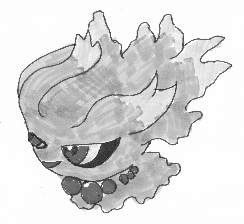

# 大会「シャドースチール」におけるムウマ統一雑感

###### ムウマ統一　紳士のチイセ

## 1．ムウマ統一の戦績等

インターネット大会「シャドースチール」（以下，今大会と言う．）に参加したムウマ統一の構成を紹介する．

※今大会までに6匹育成することは無理だったので（厳密には1匹だけレベル100時のステータスを考慮して育成したムウマがいるが，パーティ選考からは除外した．無念である．）レベル50時のステータスを考慮した努力値振りしているムウマだけで構成している．そのため，本稿では努力値掲載は見送ることとした．

| 1匹目  |                                              |
| ------ | -------------------------------------------- |
| 性格   | ひかえめ                                     |
| 持ち物 | こだわりスカーフ                             |
| 技構成 | シャドーボール　さきどり　みちづれ　かみなり |

| 2匹目  |                                                   |
| ------ | ------------------------------------------------- |
| 性格   | おだやか                                          |
| 持ち物 | しんかのきせき                                    |
| 技構成 | わるだくみ   たたりめ   あやしいひかり   でんじは |

| 3匹目  |                                                     |
| ------ | --------------------------------------------------- |
| 性格   | うっかりや                                          |
| 持ち物 | きあいのタスキ                                      |
| 技構成 | シャドーボール   かみなり   こごえるかぜ   かげうち |

| 4匹目  |                                                              |
| ------ | ------------------------------------------------------------ |
| 性格   | ひかえめ                                                     |
| 持ち物 | こだわりメガネ                                               |
| 技構成 | シャドーボール   サイコキネシス   めざめるパワー（炎）   かみなり |

| 5匹目  |                                                           |
| ------ | --------------------------------------------------------- |
| 性格   | ひかえめ                                                  |
| 持ち物 | ナモのみ                                                  |
| 技構成 | わるだくみ   めざめるパワー（格）   10万ボルト   かげうち |

| 6匹目  |                                                     |
| ------ | --------------------------------------------------- |
| 性格   | ひかえめ                                            |
| 持ち物 | オボンのみ                                          |
| 技構成 | テレキネシス   シャドーボール   かみなり   れんごく |

今大会でのムウマ統一の勝敗は45戦中，17勝28敗（1戦のみ相手側の初手降参）で最終レートは1363であった．

軽く振り返ってみると，どこか懐かしい感じ，そう，ポケモンバトルレボリューションで通信対戦をやっていたころのある意味郷愁と言えなくもない感覚だった．

悔やまれることはルールを熟読できてなかったことに尽きる．そう，今大会は1日15戦までというルールが存在し正直物足りなさがあった．このルールをちゃんと知っていればサン・ムーン両方でムウマ統一Ａ，ムウマ統一Ｂでそれぞれエントリーしてムウマ統一で計90戦できたのかと思うとやりきれない．もっとデータを収集できたはずなのに，ぐぬぬ．

## 2．ムウマ統一に対する選出傾向等

この項目および次項目では，種族統一以外のパーティについて論述していることに留意してほしい．

バトルビデオ（1戦のみ記録し忘れたため30戦分）を参照して，ムウマ統一に対して戦闘に選出されたポケモンとその回数（見せ合いから選出された3匹中にいたかどうかの回数），初手選出された回数をそれぞれ一覧にした．

**戦闘に選出されたポケモン一覧**

| ポケモン名                    | 戦闘選出 | 初手選出 | 順位 |
| ----------------------------- | -------- | -------- | ---- |
| カプ・コケコ                  | 7回      | 2回      | 1    |
| ゲッコウガ                    | 4回      | 1回      | 2    |
| ガオガエン                    | 3回      | 2回      | 3    |
| ジガルデ                      | 3回      | 1回      | 3    |
| ガブリアス                    | 3回      | 0回      | 3    |
| ガチゴラス                    | 3回      | 0回      | 3    |
| ミミッキュ                    | 2回      | 2回      | 7    |
| キュウコン   （アローラ）     | 2回      | 1回      | 7    |
| ギャラドス                    | 2回      | 1回      | 7    |
| デオキシス   （ディフェンス） | 2回      | 1回      | 7    |
| マーシャドー                  | 2回      | 1回      | 7    |
| マギアナ                      | 2回      | 1回      | 7    |
| ラグラージ                    | 2回      | 0回      | 7    |
| ポリゴンＺ                    | 2回      | 0回      | 7    |
| ギルガルド                    | 2回      | 0回      | 7    |
| ニンフィア                    | 2回      | 0回      | 7    |
| ディアンシー                  | 2回      | 0回      | 7    |
| デンジュモク                  | 2回      | 0回      | 7    |
| ネクロズマ                    | 2回      | 0回      | 7    |
| プクリン                      | 1回      | 1回      | 20   |
| ウインディ                    | 1回      | 1回      | 20   |
| パルシェン                    | 1回      | 1回      | 20   |
| ハピナス                      | 1回      | 1回      | 20   |
| ヌケニン                      | 1回      | 1回      | 20   |
| チルタリス                    | 1回      | 1回      | 20   |
| カバルドン                    | 1回      | 1回      | 20   |
| ダークライ                    | 1回      | 1回      | 20   |
| シェイミ                      | 1回      | 1回      | 20   |
| ゾロアーク                    | 1回      | 1回      | 20   |
| ゲノセクト                    | 1回      | 1回      | 20   |
| ゴロンダ                      | 1回      | 1回      | 20   |
| チゴラス                      | 1回      | 1回      | 20   |
| グソグムシャ                  | 1回      | 1回      | 20   |
| シルヴァディ                  | 1回      | 1回      | 20   |
| カプ・テテフ                  | 1回      | 1回      | 20   |
| カミツルギ                    | 1回      | 1回      | 20   |
| フシギバナ                    | 1回      | 0回      | 20   |
| ニョロボン                    | 1回      | 0回      | 20   |
| ゲンガー                      | 1回      | 0回      | 20   |
| ガルーラ                      | 1回      | 0回      | 20   |
| ミュウ                        | 1回      | 0回      | 20   |
| ドンファン                    | 1回      | 0回      | 20   |
| ライコウ                      | 1回      | 0回      | 20   |
| アメモース                    | 1回      | 0回      | 20   |
| クチート                      | 1回      | 0回      | 20   |
| ボーマンダ                    | 1回      | 0回      | 20   |
| マンムー                      | 1回      | 0回      | 20   |
| エルレイド                    | 1回      | 0回      | 20   |
| エルフーン                    | 1回      | 0回      | 20   |
| ゴルーグ                      | 1回      | 0回      | 20   |
| アマルルガ                    | 1回      | 0回      | 20   |
| フーパ（戒められし）          | 1回      | 0回      | 20   |
| フーパ（解き放たれし）        | 1回      | 0回      | 20   |
| アシレーヌ                    | 1回      | 0回      | 20   |
| ルガルガン（真夜中）          | 1回      | 0回      | 20   |
| マシェード                    | 1回      | 0回      | 20   |
| エンニュート                  | 1回      | 0回      | 20   |
| アマージョ                    | 1回      | 0回      | 20   |
| ダダリン                      | 1回      | 0回      | 20   |
| テッカグヤ                    | 1回      | 0回      | 20   |

> **合間にシャドースチールにおける雑感　その1**  
>
> 今大会の看板ポケモンたるマーシャドーとムウマの高さは0.7ｍ，アローラ図鑑による色の分類も灰色（ゴーストタイプではこの二体のみ該当）で同じである．

続いて，初手に繰り出された技において，攻撃技だったか変化技だったのか，使用された技の内訳を集計した．攻撃技においてはタイプ別に集計した．

**あくタイプ技**

| 技名           | 回数  |
| -------------- | ----- |
| あくのはどう   | 2     |
| かみくだく     | 2     |
| DDラリアット   | 2     |
| ナイトバースト | 1     |
| バークアウト   | 1     |
| ふいうち       | 1     |
| 合計           | **9** |

**ゴーストタイプ技**

| 技名             | 回数  |
| ---------------- | ----- |
| シャドーボール   | 2     |
| シャドークロー   | 1     |
| シャドースチール | 1     |
| 合計             | **4** |

**でんきタイプ技**

| 技名       | 回数  |
| ---------- | ----- |
| 10万ボルト | 1     |
| ほうでん   | 1     |
| 合計       | **2** |

**フェアリータイプ技**

| 技名             | 回数  |
| ---------------- | ----- |
| ムーンフォース   | 1     |
| マジカルシャイン | 1     |
| 合計             | **2** |

**ひこうタイプ技** 

| 技名           | 回数  |
| -------------- | ----- |
| エアスラッシュ | 1     |
| 合計           | **1** |

**むしタイプ技**

| 技名         | 回数  |
| ------------ | ----- |
| とんぼがえり | 1     |
| 合計         | **1** |

**変化技**

| 変化技         |       |
| -------------- | ----- |
| 技名           | 回数  |
| どくどく       | 3     |
| ステルスロック | 2     |
| からをやぶる   | 1     |
| つるぎのまい   | 1     |
| オーロラベール | 1     |
| やどりぎのタネ | 1     |
| 合計           | **9** |

**攻撃技・変化の比較**

| 種類         | 回数   |
| ------------ | ------ |
| 攻撃技の合計 | **19** |
| 変化技の合計 | **9**  |

>  **合間にシャドースチールにおける雑感　その2**  
>
>  今大会中，ムウマが技「はたきおとす」によって叩き落とされた回数はたったの二回である．

## 3．ムウマ統一の課題

さて，前項で示した事柄から，サン・ムーンの環境におけるムウマ統一の処遇が見えてきたように思える．とはいえ，今大会はレベル100であったこと，禁止伝説が使えたこと，持ち物の重複ができたことなど特殊な事例が存在するため確固たるものとは言い難いが，それでも推察はできる情報はそろったと言えよう．

### 3.1 選出の多いポケモン

以下，選出が多かったポケモンについて各々推察してみた．

#### カプ・コケコ

カプ・コケコは群を抜いて選出されているようだ．これはサン・ムーンの通常対戦環境（ランダムマッチ）のトレンドがそのまま適用されたと見るべきだろう．大抵のパーティにはカプ・コケコが入っており，様子見としての役割を担うのに適したステータス，かつ，自身の特性によって場に展開される「エレキフィールド」により電気技の威力が1.5倍され，攻撃するための火力が十分にあるためだと思われる．有体に言えば，とりあえず出しとけという精神ではないか．

#### ゲッコウガ

「みず・あく」の複合タイプであり，ムウマとのタイプ相性上有利である．隠れ特性「へんげんじざい」によって，繰り出した技と同じタイプになることができるのは強みと言えるだろう．この特性がムウマにとって厄介なのは，技「あくのはどう」や「つじぎり」繰り出したときに[「あくタイプ」単色になること]{.underline}である．このことを失念していたことにより「みずタイプ」には技「かみなり」をと安直な行動をとってしまったため，そのまま殴り倒されることがままあった．今にして思えば，技「こごえるかぜ」が等倍になり，能力を一段階下げれば素早さ122族のゲッコウガは辛うじて抜けるので，そこから形勢有利に持って行けたのでは？とか，「こだわりスカーフ」持ちの子を選出していれば？などと後悔している．

#### ガオガエン

「ほのお・あく」という複合タイプであり，「あくタイプ」技を一致で繰り出せること，「ほのおタイプ」には技「おにび」を無効であるため火力を下げられる心配がないことにより選出されたものと思われる．邪推すると技「じごぐづき」を覚えるため技「ほろびのうた」を封殺できるというのもあったのかもしれない......いやないか．

#### ジガルデ

いわゆる禁止伝説と言われるポケモンの一角で，猛烈な種族値と「ドラゴン・じめん」という複合タイプを持つ．技の範囲の広さに加えて，専用技「サウザンアロー」は，威力90で特性「ふゆう」を無視してムウマにダメージを与え，以後地面技が当たるようになる．なによりも，パーフェクトフォルムの尋常ならざる耐久はムウマにはどうしようもなく，圧倒されるしかない．

#### ガブリアス

ジガルデと同様に，タイプ一致の技の範囲の広さと，隙のない種族値を持つ．XYから登場した「フェアリータイプ」がサン・ムーンではより台頭してきたご時世でも，安定した立ち回りができることがパーティに入れる余地が高いということだろうか．

#### ガチゴラス

何故これほど選出されたのかもさることながら，そもそも遭遇率も高かったことも合わせて個人的には謎であった．選出が多かった理由を強いて挙げてみると，特性「がんじょうあご」によって威力が1.5倍された状態で技「かみくだく」を繰り出せるからであろうか．

#### ミミッキュ

遭遇した回数は2回と少なかったものの，その２回とも初手に選出されている．これはムウマ統一との相性上有利に戦えるからと考えられる．実際，今大会においてミミッキュは一番厄介であった．ミミッキュはムウマより素早いゴーストタイプであり，特性「ばけのかわ」によって一撃は必ず無傷で耐えることができるため「つるぎのまい」から「かげうち」を安定して繰り出せたり，「シャドークロー」によってそのまま押し切れたりできる．こちらのムウマ統一は今大会では物理受けをするための子が存在しなかったこともあり徹底的に蹂躙されることになった．

### 3.2 ムウマ統一に対する戦術

初手で繰り出された技の傾向等からムウマ統一に対しての戦術を軽くだが読み解いてみたい．

今大会においては基本的に攻撃技で殴られることが多く，基本的には自らのタイプ一致技か，ムウマの弱点を突けるゴースト技や悪技で押し切ろうという感じが見受けられた．

変化技からは，輝石を意識してか，技「どくどく」や「やどりぎのタネ」，「オーロラベール」など耐久合戦をしてじわりじわりと勝とう，技「つるぎのまい」や「からをやぶる」などで火力を上げてから倒してしまえと言った感じが見受けられる．

技「ステルスロック」や「とんぼがえり」など，「きあいのタスキ」を意識しているようにも思われる．

今大会は，受け性能を持ったムウマを入れずに挑んだため殴り倒されることが多かった．また，受け型の相手にはなすすべが無かった．

>  **合間にシャドースチールにおける雑感　その3**  
>
> 今大会中，地面技を打たれて特性「ふゆう」で無効にした場面が3回ほどあった．ムウマ統一おいて特性を生かせる場面はないと思い込んでいたが意外とそうでもないらしい．

## 4．ムウマ統一が相対した種族統一

今大会中，ムウマ統一が相対した種族統一は下記の通りである．

フワンテ統一，ニンフィア統一，メテノ統一，デカグース統一，ドラピオン統一，ドーブル統一，チコリータ統一，ヒメグマ統一，オオタチ統一，ダンゴロ統一，ツンベアー統一，ブースター統一，ヤドン統一の計13種の種族統一と相見えた．

これらの統一について対戦結果と簡単な所感を述べて紹介していこうと思う．

※ツイッターアカウント：fosterparent214に申し出てくれればバトルビデオを録画した動画をお渡しようと考えている．

### フワンテ統一

#### 勝敗：

勝ち

#### 所感：
1匹目のフワンテが「おいかぜ」「にほんばれ」と場作りし，2匹目のフワンテがZ技「ウェザーボール」を使用した．この場合は「ダイナミックフルフレイム」になるわけだが，これを繰り出されたとき「おお！これぞフワンテ統一！！！」と感嘆した．対してこちらは「シャドーボール」と「でんじは」からの「たたりめ」で，ただひたすらタイプ一致で弱点を突く戦法で押し切った．

### ニンフィア統一

#### 勝敗：

負け

#### 所感：

特性「フェアリースキン」恐るべしであった．特性「フェアリースキン」からの「ハイパーボイス」はムウマにとって致命的なダメージであり，さらにニンフィアの特殊耐久が高く，ムウマの火力では突き崩すことは難しかった．

### メテノ統一

#### 勝敗：

負け

#### 所感：

特性不理解が招いた負けである．メテノ専用特性である「リミットシールド」はHPが半分以上の状態では「りゅうせいのすがた」と呼ばれるフォルムであり，この姿では状態異常を受け付けない．このことを知らずに「でんじは」を打ち込んだのである......

### デカグース統一

#### 勝敗：

勝ち

#### 所感：

「かぎわける」はゴーストタイプ対ノーマルタイプで種族統一同士の対決だからこそ拝めたと言える．

### ドラピオン統一

#### 勝敗：

負け

#### 所感：

今大会全試合通して見ても一，二位を争う絶望感のある見せ合いだった．当然のごとく，なすすべなく粉砕された．

### ドーブル統一

#### 勝敗：

負け

#### 所感：

催眠対策を怠ったが故の負けである．また「ふういん」からの「へんしん」はしてやられた感が強かった．

### チコリータ統一

#### 勝敗：

勝ち

#### 所感：

素早さ無振りのムウマが抜かれるのを見て対戦中は何かしらのＳ調整をしているのかしら？と思ったが調べてみると最速だったらしい．チコリータは素早さ種族値45レベル100時の最速は能力値207，ムウマは85でレベル100時の無振り能力値206．改めて種族統一とは遅いからこそ素早さを振ることに意味があるのだと痛感した．

### ヒメグマ統一

#### 勝敗：

勝ち

#### 所感：

当方の「テレキネシス」から「れんごく」が安定して突き刺さった．「めざめるパワー（格闘）」による押し切りが勝因だった．

### オオタチ統一

#### 勝敗：

負け

#### 所感：

種族統一では唯一「はたきおとす」を使ってきた統一である．ゴーストタイプ対ノーマルタイプの図式となるためどうしてもお互いの一致技が無効となる．ゆえに「はたきおとす」は搭載しうる技になるのだろうと思った．最後の「かみなり」外しさえなければ私の勝ちだったのだ．やはり命中率は大事．「10万ボルト」を搭載しておけばと思ったが，同時に「かみなり」でなければ火力が足りぬとも思った．

### ダンゴロ統一

#### 勝敗：

勝ち

#### 所感：

素早さの差，「わるだくみ」や「めざめるパワー（格闘）」による勝ちだった．相手側のダンゴロの「じゅうりょく」でムウマの特性「ふゆう」を無効にしたうえで「どろかけ」で命中率を下げてくる戦術は，種族統一らしいものであろう．

### ツンベアー統一

##### 勝敗：

勝ち

#### 所感：

今大会で一番燃えた試合であったように思う．この試合は，特性「ゆきかき」や隠れ特性「すいすい」などを活かし素早さを上げて抜かれるのではと警戒していたが，そんなことは一切なかった．このツンベアー統一は，技「あられ」にて天候を霰状態にして，おそらくだが特性「ゆきがくれ」発動で回避率を上げたうえで，なんと「ぜったいれいど」を打ち続けてきたのだ．私の方は技「テレキネシス」から「れんごく」で一体はもっていきたいと考えていた．実際，一体目は「れんごく」で仕留めた．二体目が出てきて「ぜったいれいど」を打ってきたとき私は勝負しなければと思った．私もせめて「テレキネシス」なしで「れんごく」を当てるべきだと．

### ブースター統一

#### 勝敗：

負け

#### 所感：

Z技「おいわい」恐るべし，特性「こんじょう」恐るべしであった．まず，Z技「おいわい」は全能力を一段階上がる．そのうえで持ち前の特殊耐久から技「バトンタッチ」でそのまま能力上昇を引き継げること，特性「こんじょう」が発動した際の「かみつく」の火力を侮ったことが敗因となった．

### ヤドン統一

#### 勝敗：

勝ち

#### 所感：

タイプ相性と素早さの差からムウマ統一が押し切った形になったが，相手のヤドンが「トリックルーム」を形成し「しねんのずつき」を繰り出してきたときはこのまま怯みで押し切られるのではと内心はらはらしたことは付記しておく．

> **合間にシャドースチールにおける雑感　その4**
> 技「ほごしょく」はランダムにおける対戦においては「ノーマルタイプ」になる．また，フォルムチェンジをすると解除されるようである．今大会ではジガルデに使われ翻弄，苦戦を強いられたため，印象が心に深く残った．

## 5．大会総括

今大会を通してわかったことがある．それは私の思考が完全に停止いるということだ．つまり，私のムウマ統一構築・運営観念が第五世代辺りで，下手をすると第四世代を最後に止まってしまっている．これはポケットモンスターブラック・ホワイト以降，XY，サン・ムーンに至るまでランダムマッチにおいて種族統一で潜れないことによる情熱の低下が起因しているのは間違いない．のだが，それだけではなく情熱を維持するための足掻きを適当にやってきた付けが回ってきたのだろう．自業自得でもあった．そんな自暴自棄状態にあった私の前に降ってきたのが今大会であった．今大会のルールはそんな私の情熱を沸騰させるには充分であった．

実際，今大会においては一戦一戦熱い闘志でみなぎってハラハラドキドキ手に汗握る状態であった．

そして，今回いろいろ見えたことから新しくムウマ統一を受けに比重を置くべきではないか，火力の担保をどうするのか，という具合に構築を見直すきっかけになったように思える．育成熱も沸いてきた．これらの情熱を活かしたい．

願わくは今大会のような，まさしくフリー状態のランダムマッチが搭載されんことを．

## 6．おまけ

私の拙い画力でダイヤモンド・パールのムウマを再現してみた．

