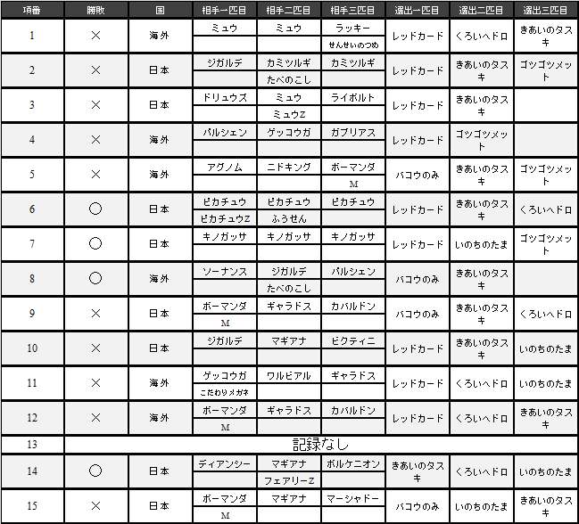
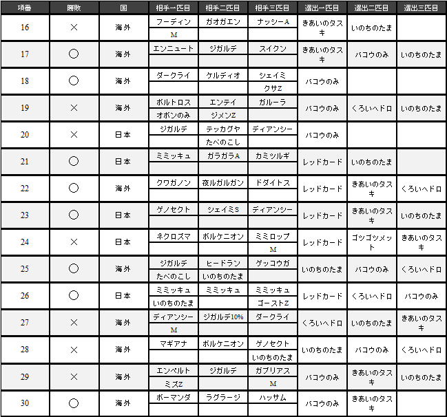
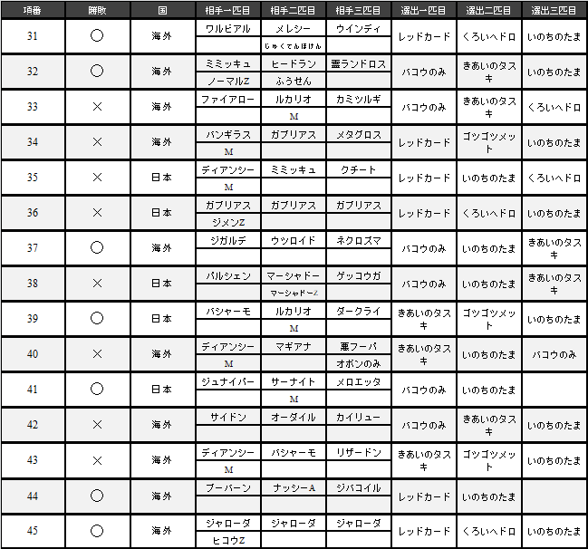

# シャドースチールとペンドラー統一

###### ペンドラー統一パ　ぴすた

## 1．はじめに

シャドースチールとは，2017年8月25日から8月28日までの三日間で行われたシングルバトルの公式大会である．この大会は，「図鑑Noが同じポケモンを複数選出することができる」「複数のポケモンに，同じ道具を持たせることができる」というルールにより，種族統一パが普通パとランダム対戦を行うことができる．筆者は，めったにないこの機会に育成中の種族統一パの完成度を高めること，ならびに自身のモチベーション向上を目的として参加することにした．

## 2．シャドースチールにおける留意点

まずは参加にあたって対戦で留意すべきポイントについて記す．ポイントは「図鑑Noが同じポケモンを複数選出することができる」「使用可能なポケモンであれば，覚えている技はそのままに使用できる」「対戦中，すべてのポケモンがレベル100になる」である．

「同じポケモンを複数選出できる」という点については語るべくもないが，「使用可能なポケモンであれば覚えている技をそのままに使用できる」という点は，種族統一パを扱うトレーナーにとっては僥倖である．例えば，エメラルドなどの第三世代限定の教え技をはじめとして，配布された特別な技を覚えたポケモンを使用することができる．また最近では，VC（バーチャルコンソール）によって，ポケモン赤緑金銀の技マシンを覚えさせた特別なポケモンも存在する．これらのポケモンを使用できることは，パーティ構築の幅を大きく広げることができるほか，対戦した普通パの意表を突いた戦術で勝利を目指すことができる．

しかし，このルールでは種族統一パにとって追い風である一方で厄介な問題がある．それが「対戦中，すべてのポケモンがレベル100になる」という点だ．これにより，バトルチームとして登録したポケモンはすべてレベル100の状態でバトルに参加することになる．つまり，レベル50での対戦を想定したポケモンとはステータス実数値が異なってしまうことになる．レベル50とレベル100においてステータス実数値がずれた場合，具体的には次のような問題が発生する．

### 2-A．素早さ種族値70族が「こだわりスカーフ」を持っても130族を抜けない

レベル50のときは，素早さ種族値70のポケモンが「こだわりスカーフ」を持つと実数値が201となり，最速130族を抜くことができる．しかし，レベル100においては「こだわりスカーフ」を持っても実数値が393止まりになり，130族の394を抜けない．種族統一パにおいて先制技を持っていないポケモンは，「こだわりスカーフ」持ちによって二体以上のポケモンに先制してアドバンテージをとることが重要である．そのため，この点に留意したパーティ構築ができない場合，それがそのまま勝敗に直結してしまう恐れがある．

### 2-B．仮想敵への耐久調整が崩れてしまう

種族統一パにおいては苦手なポケモンに対してピンポイントな対策が必要になる場合がある．通常攻撃ではダメージを与えることが難しい場合，耐久調整によって確実に耐えて「カウンター」や「じゃくてんほけん」を利用した反撃を行うのだ．しかし，レベル50とレベル100では努力値に対するステータス実数値が異なるため，特に耐久種族値の低いポケモンであればレベル50の環境を前提とした対策では攻撃を耐えられない恐れがある．

### 2-C．HP実数値がずれることによる戦術の瓦解

レベル50とレベル100では同じ努力値でもHP実数値の偶奇が異なってくるため，想定していた戦術が使えない場合がある．例えば，「みがわり」が4回貼れない場合，16の倍数でなくなり「たべのこし」の回復量が減ってしまう場合，実数値が奇数から偶数に変わることで「ステルスロック」や「ちきゅうなげ」のダメージ割合が変わる場合である．このような場合，きのみや特性の発動に関わるため，想定していた戦術が使えずに思わぬところで足をすくわれてしまう恐れがある．このルールへの理解が乏しかったために実戦では倒すことのできないポケモンが存在していた．

### 2-D．低レベル戦術の瓦解

有名どころで言えば，特性「がんじょう」を利用したレベル1ココドラや，「トリックルーム」で先手をとるためにレベルを下げる戦術があるものの，強制的にレベルが100になってしまうため使用できなくなる．

以上のことからシャドースチールにおいてはそのルールから自由なパーティを楽しむことができる一方で，周到な準備を行わなければ思わぬ弱点を抱えた状態で対戦を継続しなければならない（バトルチームは一度固定すると大会終了まで変更できない）．

## 3．結果

本稿では本大会に参加した種族統一パとその対戦結果について記す．

### 3-A．大会に参加したポケモン

今大会で選択したポケモンはペンドラー統一である．実績の開示にあたってこのポケモンについて紹介する．

| ペンドラー          | HP   | 攻撃 | 防御   |
| ------------------- | ---- | ---- | ------ |
| 種族値   合計   485 | 60   | 100  | 89     |
|                     | 特攻 | 特防 | 素早さ |
|                     | 55   | 69   | 112    |

タイプは虫毒で，特性「かそく」による素早さに特化したポケモンである．鋼タイプを呼びやすく，弱点も多いうえ「トリックルーム」で素早さを逆転されることも多い．しかし，大会参加にあたりペンドラーを選んだのには理由がある．

#### ・圧倒的な素早さ

競争の激しい100族を抜ける素早さと特性「かそく」により先手をとることに長けている．種族統一パは弱点をつかれやすいことから，行動回数を稼ぐための素早さが重要なファクターになる．その中で常に頭を押さえて行動できることはペンドラーの優秀な特長である．

#### ・豊富な攻撃範囲

ペンドラーが主に扱う技には「メガホーン」「どくづき」「じしん」「いわなだれ」「ばかぢから」がある．弱点であるエスパーへの有効打として虫技，環境にはびこるフェアリーに有効な毒技，呼びやすい鋼に有効な地面技となかなかの攻撃範囲である．攻撃種族値は100と物足りないものの，「つるぎのまい」によるパンプアップもできるため対戦相手によっては全抜きも期待できる．

#### ・がむしゃら

等倍や防御特化の相手には火力が足りないことが多く，特攻も貧弱であるため突破できないポケモンも多い．しかし，この技の運用によってゴーストタイプを除いたすべてのポケモンに対して防御を無視した火力を叩き出すことができる．

#### ・どくびし

特性「かそく」との相性が抜群であり，対策をしていないパーティであれば「まもる」と「みがわり」をし続けるだけで完封できる．種族統一パにおけるペンドラーならではの強力なコンボが可能である．

以上の理由から，普通パに対しても頭を押さえつつ有効打を撃つことができ，「どくびし」による一方的な試合展開も期待できるペンドラー統一にて大会に参加することとした．

### 3-B．実績

三日間の対戦実績は次のとおりである．

| 対戦数 | 勝ち       | 負け       |
| ------ | ---------- | ---------- |
| 45     | 20         | 25         |
| 勝率   | 最終レート | 順位       |
| 44.4%  | 1475       | 9659/14469 |

勝ちのうち1勝は相手の回線切れによる不戦勝，種族統一パ同士の対戦は5戦4勝1敗であった．このことから純粋な普通パとの対戦結果は39戦15勝による勝率38.5％となり，事前に設定していた目標勝率50％には届かなかった．

## 4．分析

より完成度の高いパーティを育成するために本稿では大会結果を分析する．

### 4-A．シャドースチールで出会ったポケモン

大会終了後，44戦のBVを鑑賞してペンドラー統一がどのようなポケモン，パーティと対戦したかを集計した．結果，選出されなかったポケモンを除いて77種族との対戦を行っていた．選出の比較的多かったポケモンは，ジガルデが9体，ディアンシーが7体を筆頭に，ガブリアス，ミミッキュ，マギアナ，カミツルギ，ゲッコウガ，ボーマンダと続いた．シャドースチールマスターカテゴリにおけるポケモンランキング\[1\]と比較してみてもランキングの上位に入るポケモンばかりである．ペンドラー統一にとっては，伝説ポケモンを除けば仮想敵として想定していたものも多かったため対処がしやすく，また対処が難しいテッカグヤに1回しか当たらなかったことが勝率につながったものと推察する．

また，種族統一パとは大会中に5回対戦する機会があった．対戦したのはピカチュウ，キノガッサ，ミミッキュ，ガブリアス，ジャローダである．いずれの試合も有利に展開できたものの，ガブリアスについては手痛いプレイングミスにより敗北を喫した．

### 4-B．初手にでてくるポケモンの傾向

種族統一パの試合では初手の選出が普通パ以上に重要になる．タイプ被りの影響から初手の選出ミスによっては2タテ，3タテされる可能性が高まるからだ．そのため，本大会でペンドラー統一に相対した普通パの選出について調べてみた．結果として多かった選出はジガルデ，ディアンシーが4体，ミミッキュ，ボーマンダが3体と次いで多かった．そのほかの試合を含めて全44試合をみてみると鋼，地面，ドラゴン，岩タイプの選出が多く，全体的に初手はペンドラーが一撃で倒すことのできない，防御よりのポケモンの選出が多かった．割合としては防御寄りのポケモンが66％，攻撃寄りのポケモンが34％だ．この結果から，種族統一パと相対したとき，まずは選出しても一撃で倒されないであろうポケモンをだして「様子見」するという対戦相手の心理が働いたと思われる．

### 4-C．ペンドラーの選出パターン

次にペンドラー統一の選出パターンを振り返ってみた．今回参加したペンドラー統一の構成を次に示す．

|        | ペンドラーA    | ペンドラーB  |
| ------ | -------------- | ------------ |
| 持ち物 | きあいのタスキ | いのちのたま |
| 技1    | どくづき       | まもる       |
| 技2    | いわなだれ     | いわなだれ   |
| 技3    | じしん         | じしん       |
| 技4    | つるぎのまい   | どくづき     |
|        | ペンドラーC    | ペンドラーD  |
| 持ち物 | バコウのみ     | くろいヘドロ |
| 技1    | がむしゃら     | おいうち     |
| 技2    | どくどく       | どくどく     |
| 技3    | いわなだれ     | みがわり     |
| 技4    | まもる         | まもる       |
|        | ペンドラーE    | ペンドラーF  |
| 持ち物 | ゴツゴツメット | レッドカード |
| 技1    | ばかぢから     | どくびし     |
| 技2    | つるぎのまい   | ばかぢから   |
| 技3    | がむしゃら     | まきびし     |
| 技4    | みがわり       | まもる       |

選出のパターンは大別して以下の3つになる．

パターン1：初手に「レッドカード」持ちを選出

パターン2：初手に「バコウのみ」持ちを選出

パターン3：初手に「きあいのタスキ」持ちを選出

今回はパターン1，パターン2，パターン3の順でより多く選出していた．

詳細な型の説明は割愛するがパターン1は「どくびし」を利用した耐久，パターン2はファイアローをはじめとした飛行タイプメタと物理流し，パターン3は事故防止を目的とする「きあいのタスキ」を初手に選出したしたものである．

結果的にパターン1は選出10勝ち6で全てのパターンで最も高い勝率60％であり，パターン2は選出8勝ち2の勝率25%，パターン3は選出4勝ち2の勝率50%であった．

これらの勝率の要因は，それぞれのパターンで設定された役割をいかに遂行できていたかが関わるものと思われる．パターン1は明確な戦略があること，選出の読みが成立していることで勝ちを得ており，パターン3は選出を読み切れずとも事故を防げる「きあいのタスキ」が役割を果たしていた．特にパターン1では，「4-B」でも示している対戦相手の「様子見」の選出に刺さっており，「どくびし」を展開する戦略を成功させられたことが大きな要因と思われる．

これら成功要因の一方で，パターン2では二番手，三番手にも個体のばらつきが多く，選出が読み切れていなかったことが原因で負けていると思われる．

以上のことから，パーティ改善の必要性が生じたと考え，次稿にて具体的な改善策を検討していく．

## 5．育成

シャドースチールにより得られた知見から，ペンドラー統一へ次の改善を施すこととした．主な改善の方針としては下記の三つとなる．

甲．勝ちパターンで利用した技を残す

乙．あればよかった技と努力値振りを追加する

丙．甲と乙の結果，育成した個体で新たな選出パ

ターンを確立する

また，乙の範囲となるが今後の大会に備えてシャドースチールの要件であるレベル100でもレベル50でも戦える個体の育成を行う．

### 5-A．きあいのタスキ型へのへ改善

この型への改善は性格の変更，「いわなだれ」と「つるぎのまい」の削除，「メガホーン」と「がむしゃら」の追加となる．BWで育成したこの型は元来，ファイアロー対策及び広い技範囲による抜き性能がコンセプトであった．シャドースチールにおいては，事故防止とその広い技範囲で役割を果たしてくれたものの，「つるぎのまい」をもってしても火力不足となることが多く，むしろ「がむしゃら」が欲しい場面が多かった．さらに，パーティ内にメガフーディンに対して虫技を撃てる個体がいなかったこと等の理由から，上記の改善を施すに至った．

### 5-B．くろいヘドロ型への改善

この型への改善は努力値配分の変更，「おいうち」の削除，「いわなだれ」の追加である．努力値配分については，割り振りによりレベル100かレベル50かを問わずに，「くろいヘドロ」の最大回復量を維持できることが判明したからである．また，ギルガルドへの役割遂行技であった「おいうち」は一度しか役割を果たせなかったことから，広範囲かつ特性「かそく」によりアドバンテージを稼ぎやすい「いわなだれ」へと変更することにした．

### 5-C．いのちのたま型への改善

この型は，本大会において初手に選出されやすいパルシェンへの役割を持てることがわかった．元来，足りない火力を範囲と持ち物で補う「きあいのタスキ」に次ぐ汎用型だが，大会ではその運用によって苦手としていたパルシェンに対しても役割を持つことができた．加えて，「ばかぢから」を採用することにより，同じく初手に選出されやすいバンギラスも役割対象にすることができる．タイプ一致技である「どくづき」を削るのは痛いが，今後の新たな選出パターン確立のためにも改善を施して，更なる調整を重ねていく下地とする．

### 5-D．ゴツゴツメット型への改善

この型には致命的な欠陥がある．第七世代環境において有効打のないテッカグヤへの役割を持っていたものの，シャドースチールによりレベル100となったことから，「みがわり」と「がむしゃら」を併用した運用ができなくなっていた．大会では置物と化してしまったため，今後はHP実数値の調整ならびに型の大きな変更が必要となる．

### 5-E．レッドカード型への改善

「どくびし」戦略の要となるこの型は，対戦相手の「様子見」選出により，大会ではほぼ確実に役割を遂行してくれた．この型への改善は「ばかぢから」と「まきびし」の削除，「がむしゃら」と「どくどく」の追加となる．種族統一パであるガブリアス戦では，「レッドカード」発動後に耐久型と対面してしまったため，戦略が機能せずに敗北を喫した．「ばかぢから」はこの型で撃つ相手がいないこと，「まきびし」も「きあいのタスキ」型から「つるぎのまい」を削除したことによる勝ちパターンが変更から削ることとし，より安定して耐久型へのプレッシャーをかけられる技を採用することとした．

## 6．おわりに

シャドースチールという大会において，当初より目的としていたパーティの育成を概ね達成することができた．普通パにおいても同様だが，種族統一パにおいても前提条件を確認してプランを立てる(P)，対戦する(D)，結果を分析して改善を施す(C)，再び対戦する(A)というPDCAがパーティ構築に役立ってくる．今回，不足があったとすれば，実際には環境予想をして臨めていないことと，改善後の運用ができていないという点だ．種族統一パにおいてはポケモンバトルレボリューション以来，ランダム対戦ができる環境がなく，PDCAを回すことができなかったが，この大会ではじめてこれを実践することができた．これを機に，近々発売される新作において「なんでもあり」ルールのランダム対戦の実装に心より期待する．

## 参考文献

\[1\] "ポケモングローバルリンク,インターネット大会,シャドースチールマスターカテゴリ"， https://3ds.pokemon-gl.com/competitions/4118/

**付録1．8月25日分の対戦結果**

**付録2．8月26日分の対戦結果**

**付録3．8月27日分の対戦結果**

※道具は判明したもののみ記載