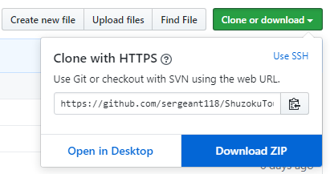

# 種族統一学会論文誌Vol.5 募集要項

## 頒布先（予定）
コミックマーケット98  

> 2019年夏(？)コミ　※2020年5月2日（土）～5日（火）開催

数が集まらない、落選、その他やむを得ない理由で延期する場合があります。

## 募集内容

- 種族統一パに関する文章
  
  - 種族統一パのパーティ構築
    実際に使用していない考察のみでも可
  - 種族統一パの対戦結果の考察
    相手が種族統一パである必要はない
  - 種族統一パは1種類に限定しなくても良い
  - 種族統一パ的な環境考察・願望・if
  - 対戦動画の紹介
  - 世代は問わない
    - ガラル入国拒否された人も安心？
- タイトル・著者名は必須
- タイトルは幅の都合上文字以内に収めるのが望ましい
  - 著者名は『○○統一パ　××××』と記載することを推奨
- 共著も可
- 初公開以外の扱い
  - 他人の考察の完全コピーは不可
    - 当人の了承が取れるのであれば可
    - その場合は共著扱いとすること
  - 自身の過去の作品と同等の内容でも可
    - ブログ、同人誌、SNSでの発言など
    - その際、URLや出典元などを記載しても構わない（ブログ、同人誌の場合は推奨）
- 文量
  - 文書１つにつき文字数は自由
  - 表や画像などを使用しない場合約1700文字で1ページになるので切りの良さそうな分量だと嬉しい
  - 複数の文書の投稿も可能
- 公開規定
  - 応募された文書は原則掲載する
    - 誹謗中傷の類を含む文書は不可
    - あくまで人に見せる文書ということで常識の範囲内でお願いします
  - 提出する文書は**自分が作成した文書**に限って本誌頒布**前後に関わらず**SNSやブログなどで自由に公開しても良い（宣伝もOK）
  - 発行日から約1年後にWeb上で一般公開される
- 内容に関して簡単なチェック・修正あり（修正を行った場合、必ず確認を取ります）
  
  - 募集要項を満たしているか
  - 誤字脱字　　
  - 文体

## 執筆上の注意

### ポケモン界で一般的な共通項目の説明
HABCDS 等の一般的な略称は専用の頁を作成し説明を行うので、文書の本文中に明記する必要はありません

### 技・道具・特性の表記

- 本文中に表記する場合、ゲーム中の表記に従い『「」＋ひらがなカタカナ表記』を使用する

  > **「れいとうビーム」「おやこあい」「じゃくてんほけん」**

- 「」を使用するのは前後の平仮名との混同を避けて可読性を向上させるため

- ただし,ポケモンの型に道具の名前を含む場合は例外としても構いません。

  > 例)
  > 輝石ムウマ,「しんかのきせき」持ちムウマ
  > 弱点保険ギルガルド,「じゃくてんほけん」持ちギルガルド
- その他、平仮名などと混同してしまいそうなゲーム内用語には「」を付けることを推奨

### 色

モノクロ印刷で出版するため、すべてグレースケールでの仕上がりになるので注意

- 画像や表など最終的にグレースケールになる
- 本文は色を使わずに黒文字のみ使用すること

### 推敲対象の例

- カンマとピリオド
  - 「。」→「．」
  - 「、」→「，」
- 接続詞の後の「,」
  - 「しかし統一パは」→「しかし,統一パは」
- 漢字の接続詞
  - 「従って」→「したがって」
  - 「又」→「また」
  - 「更に」→「さらに」
- 長すぎる文章の分割
  - 一文は長くても 2~3 行（40～60文字）程度が望ましい
-  区切りの分かりにくい文章に「,」の追加
- だ調、である口調への変更
  - 「有効です」→「有効である」

### ゲーム、PGL等のキャプチャ画像は使用不可

- 権利上のやっかいな問題を回避するため
- 絵などの使用は自由
  - 自作以外は製作者の許可を取り必ず名前を記載すること
  - グレースケールになることに注意
- 動画やTwitterへの動画投稿へのリンクは歓迎
  - 必ずしも保証する義務はありませんがリンク切れには注意して頂けると助かります

### 横幅の注意

論文タイトルや表が横に長くなりすぎないように注意していただけると助かります。

- 最終的に2段組みの論文形式で出力されるため
- 表の場合は横23文字以内、タイトルは34文字以内が目安

## 提出形式

下記の形式のいずれか。

- Markdown
  - [Github上の過去の論文の形式](<https://github.com/sergeant118/ShuzokuTouitsuJournal>)に従うのが望ましい  
  上記リンク先の「Download ZIP」から各論文のMarkdownファイルをダウンロードできます。  
  
    - タイトル：見出し1『#』
    - 著者名：見出し6『######』
    - 各章：見出し2『##』
      - 以下、サブタイトルごとに見出しレベルを下げる
- 論文形式（配布されている[wordテンプレート](Shuzoku_template.docx)等）
  - 複雑な表を使用したい場合は推奨
  - Markdownに変換するのでフォントや見出しの大きさには拘らなくてOK
  - 二段組に拘らなくても構わない
  - ヘッダー・フッターは後で調整するので気にしなくていいです
- テキストのみ
  
  - txtファイル、PDF、Googleドキュメントなど文字（と表等）コピーができれば何でもOK
- 紙
  
  - 前回あったので一応記載。OCRかけてどうにかします
  
    

Markdown以外は受け取り後、こちらでMarkdownに変換します。

最終的にMarkdownから過去の論文誌のような形式に変換して発行されます。

## 提出先

主催者まで下記の方法でファイル等を送信してください。

- [種族統一Slack](https://join.slack.com/t/shuzokutouitsupoke/shared_invite/enQtNDg2MjI1NDgzMTEwLTNkMGRiMGJjYzdkYmIwZTAzNWQ3ODY1YzM5YjYzYmUwZDM2MDcxY2I5ZjExZTljN2JiOTdmNjc5MjhjZDg0MWE)のDM
- Twitter
  - [sergeant118](https://twitter.com/sergeant118)
- メール
  - [sergeant118@gmail.com](mailto:sergeant118@gmail.com)

提出する際に下記の項目についてもお知らせください

- 奥付のクレジットに使用する名前（必須）と連絡先（任意：TwitterIDとか）

## 期限

第一次締め切り　2020/3/15 23:59

## 提出後の流れ

会計報告や電子版の配布などにSlackを使用するので[種族統一Slack](https://join.slack.com/t/shuzokutouitsupoke/shared_invite/enQtNDg2MjI1NDgzMTEwLTNkMGRiMGJjYzdkYmIwZTAzNWQ3ODY1YzM5YjYzYmUwZDM2MDcxY2I5ZjExZTljN2JiOTdmNjc5MjhjZDg0MWE)へ参加して頂けると助かります。

また、論文提出後の修正のやりとりもこちらでできると楽かなと思います。

宗教上の理由などでSlackへの参加が不可能な場合は別途方法を考えます。

今回からの新しい取り組みとして、最初の論文提出後（＝合同誌参加確定）に参加者全員がそれぞれ提出した論文を観覧できる状態にします。

- 主目的はヒューマンエラー回避のため
  - 主催者と執筆者本人だけだと絶対見逃す（過去、見逃した）
  - 他の参加者の論文の誤字などを発見した場合は報告して頂けると助かります
    - 他の参加者の論文チェックは義務ではありません
    - 発行まで見たくない場合はスルーしても構いません
- 発行前に他参加者の論文を見ることで新しい発想が生まれるかも？
- 場合によっては論文提出者以外のチェック要員にも公開する可能性があります

## 謝礼（複数選択可）

- 見本誌（冊子・PDF）
- ワタシハミノマダムチョットワカル（冊子・PDF）
- その他（状況によって増える可能性もあります）

謝礼選択の希望調査は入稿完了後に別途実施します。

※冊子版は希望者のみ郵送or会場手渡しで対応します。

## 印刷・頒布

参加申し込み、印刷、頒布、在庫管理に関しては、主催者に一任する。

印刷費用・売上に関しては即売会終了後に参加者に情報を提示する。

## 連絡先
- メール：[sergeant118@gmail.com](mailto:sergeant118@gmail.com)
- Twitter：[sergeant118](https://twitter.com/sergeant118)
- [種族統一Slack](https://join.slack.com/t/shuzokutouitsupoke/shared_invite/enQtNDg2MjI1NDgzMTEwLTNkMGRiMGJjYzdkYmIwZTAzNWQ3ODY1YzM5YjYzYmUwZDM2MDcxY2I5ZjExZTljN2JiOTdmNjc5MjhjZDg0MWE)

質問・相談などは随時受け付けています。

## Markdown支援

Markdownで記述する上で助けになりそうなリンクを紹介します。

**[Typora](https://typora.io/)**  

**[MarkdownエディタにTyporaを超推ししたい件](https://qiita.com/kenji_shinoda/items/97320dc3f40a4c98df35)**  

**[Qiita マークダウン記法 一覧表・チートシート](https://qiita.com/kamorits/items/6f342da395ad57468ae3)**  
